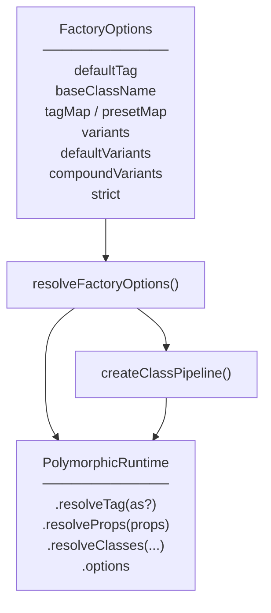
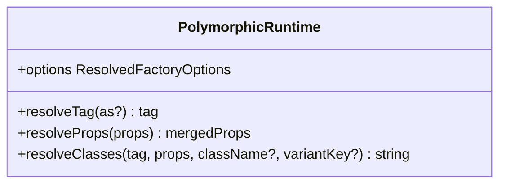
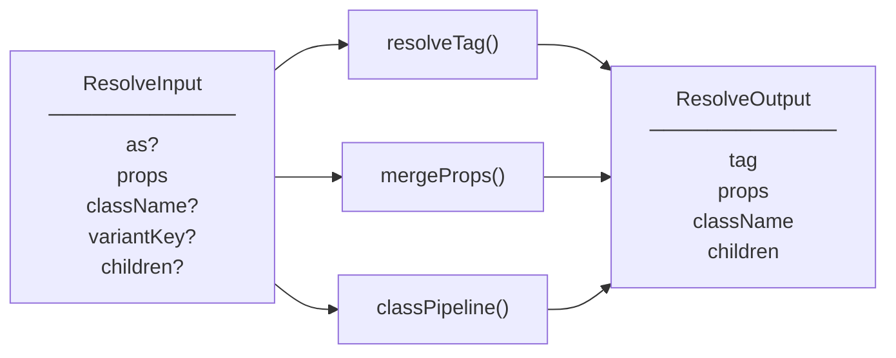
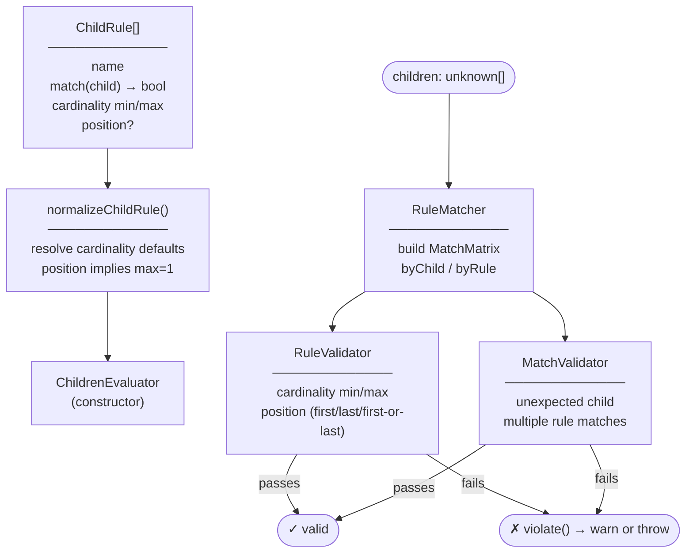
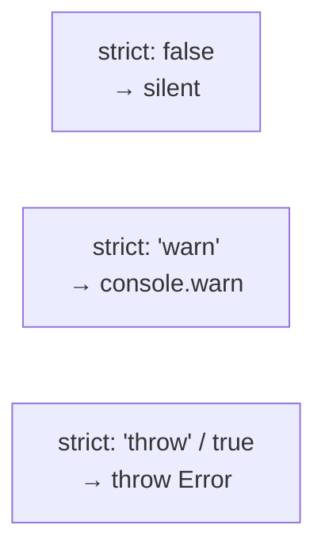

# `@polymorphic-ui/core` — Architecture

## What it is

`@polymorphic-ui/core` is a framework-agnostic TypeScript library that resolves **polymorphic component behaviour**: which HTML element or component to render (`as` prop), how to merge default and consumer props, and how to compose class strings from variants, presets, and layout state.

It has no dependency on React, the DOM, or any specific CSS methodology.

---

## Standalone or adapter-required?

**Core is fully standalone.** Every export is usable in any JavaScript/TypeScript environment without a framework.

A **framework adapter layer is optional but beneficial** for ergonomics:

| Concern             | Core provides                           | Adapter adds                                                      |
| ------------------- | --------------------------------------- | ----------------------------------------------------------------- |
| Tag resolution      | `resolveTag(defaultTag, as)`            | Narrows `ElementType` to the framework's element union            |
| Prop merging        | `resolveProps(props)`                   | Event handler merging, framework-specific prop normalisation      |
| Class composition   | `resolveClasses(...)`                   | CSS-methodology post-processing (e.g. `@polymorphic-ui/tailwind`) |
| Children validation | `ChildrenEvaluator.evaluate(unknown[])` | Flattens framework children before calling                        |
| ARIA validation     | `AriaPolicyEngine.validate(tag, props)` | Calls before rendering                                            |
| Rendering           | —                                       | Creates and renders the resolved element                          |

The three `PolymorphicRuntime` methods (`resolveTag`, `resolveProps`, `resolveClasses`) are designed to be called inside a component render function. `createResolverPipeline` bundles them into one call for adapter convenience. `options` exposes the frozen resolved configuration.

---

## Source layout

```
src/
├── factory/          createPolymorphic — the main entrypoint
├── options/          resolveFactoryOptions — normalises factory config
├── resolver/         resolveTag, resolveProps, createResolverPipeline
├── styles/           Class pipeline: CVA, static/variant resolvers
├── children/         ChildrenEvaluator — child structural constraint system
├── validator/        AriaPolicyEngine — ARIA role validation
├── base/             StrictBase — shared strict-mode violation infrastructure
├── types/            All exported TypeScript types
└── utils/            cn (clsx wrapper), mergeProps, NonEmptyArray
```

---

## Factory entrypoint



`createPolymorphic(options)` freezes the resolved options, builds the class pipeline once, and returns a lightweight runtime object. The pipeline instances (`StaticClassResolver`, `VariantClassResolver`) are created once per factory call and cached for the lifetime of the runtime.

---

## PolymorphicRuntime



### `resolveTag`

Returns `as ?? defaultTag`. No side effects.

### `resolveProps`

Shallow-merges `defaultProps` with the consumer's props. Consumer props win on conflict.

### `resolveClasses`

Runs the full class pipeline (see below).

### `options`

The frozen `ResolvedFactoryOptions`. Useful for adapters that need to inspect the factory configuration.

---

## Class pipeline

`resolveClasses` resolves the full class string by running `StaticClassResolver` and `VariantClassResolver` in parallel, then joining with `cn()`.


CSS-methodology-specific post-processing (such as Tailwind layout-aware class filtering) is handled by `@polymorphic-ui/tailwind`, which wraps `createClassPipeline` and applies it after the base pipeline runs.

---

## Resolver pipeline

`createResolverPipeline` is a convenience wrapper that combines all four runtime steps into a single function call. It is intended for framework adapters that want to resolve everything in one pass.



Children pass through `createResolverPipeline` unchanged. Flattening framework children into a plain array is the adapter's responsibility before calling `ChildrenEvaluator.evaluate`.

---

## Children constraint system

`ChildrenEvaluator` enforces structural child rules on a flat `unknown[]` children array.



Both `RuleValidator` and `MatchValidator` extend `StrictBase` and respect the `StrictMode` setting (`false` / `'warn'` / `'throw'`).

---

## ARIA validator

`AriaPolicyEngine` is a standalone class — it is not embedded in `PolymorphicRuntime`. Adapters import and instantiate it directly.

```mermaid
flowchart LR
    tag([tag: unknown])
    props(["props: Record&lt;string, unknown&gt;"])

    guard{typeof tag
=== 'string'?}

    pass([return props unchanged])

    rules["#rules pipeline
─────────────
① checkInvalidRoleOverride
② checkRedundantRole
③ checkStandaloneRegion"]

    valid{all rules
pass?}

    strip["strip role
from props"]

    out([return props])
    warn([violate() → warn or throw])

    tag & props --> guard
    guard -- no --> pass
    guard -- yes --> rules --> valid
    valid -- yes --> out
    valid -- no --> warn
    valid -- no --> strip --> out
```

`ariaRolePolicy` maps six landmark elements (`article`, `aside`, `footer`, `header`, `main`, `nav`) to their implicit ARIA roles and classifies which have strong implicit roles.

---

## Strict mode

All three validation classes (`AriaPolicyEngine`, `RuleValidator`, `MatchValidator`) extend `StrictBase`, which controls violation severity:



`ChildrenEvaluator` passes its `strict` setting down to both `RuleValidator` and `MatchValidator` at construction time.

---

## Framework adapter pattern

A minimal framework adapter uses core as follows (pseudocode):

```
adapter render(as, props, children, variantKey):
  tag    = runtime.resolveTag(as)
  merged = runtime.resolveProps(props)
  cls    = runtime.resolveClasses(tag, merged, merged.className, variantKey)
  safe   = ariaValidator.validate(tag, merged)
  flat   = framework.flattenChildren(children)      // adapter's job
  evaluator.evaluate(flat)                          // child rules
  return framework.render(tag, { ...safe, className: cls }, children)
```

The adapter provides:

- Framework-specific child flattening before `evaluate`
- Framework-specific element rendering from the resolved `{ tag, props, className, children }`
- Narrows `ElementType` to the framework's element union (`React.ElementType`, `SvelteComponent`, etc.)
- Event handler merging and any other framework-specific prop normalisation
