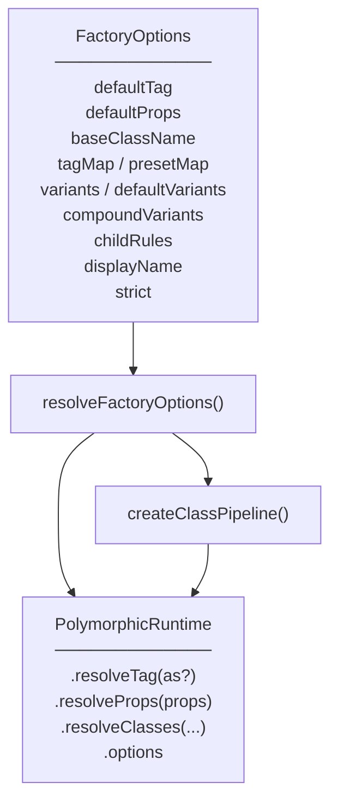
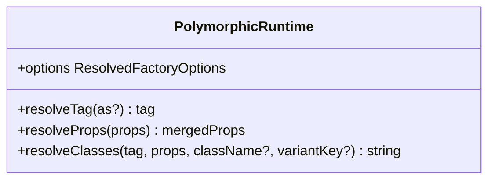
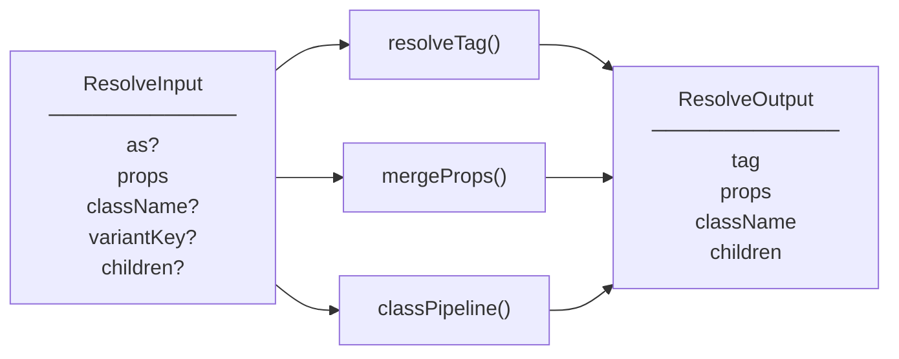
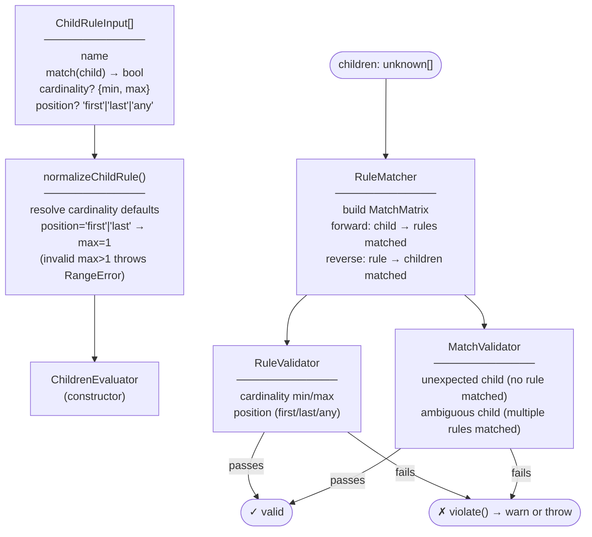
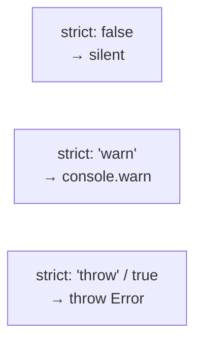
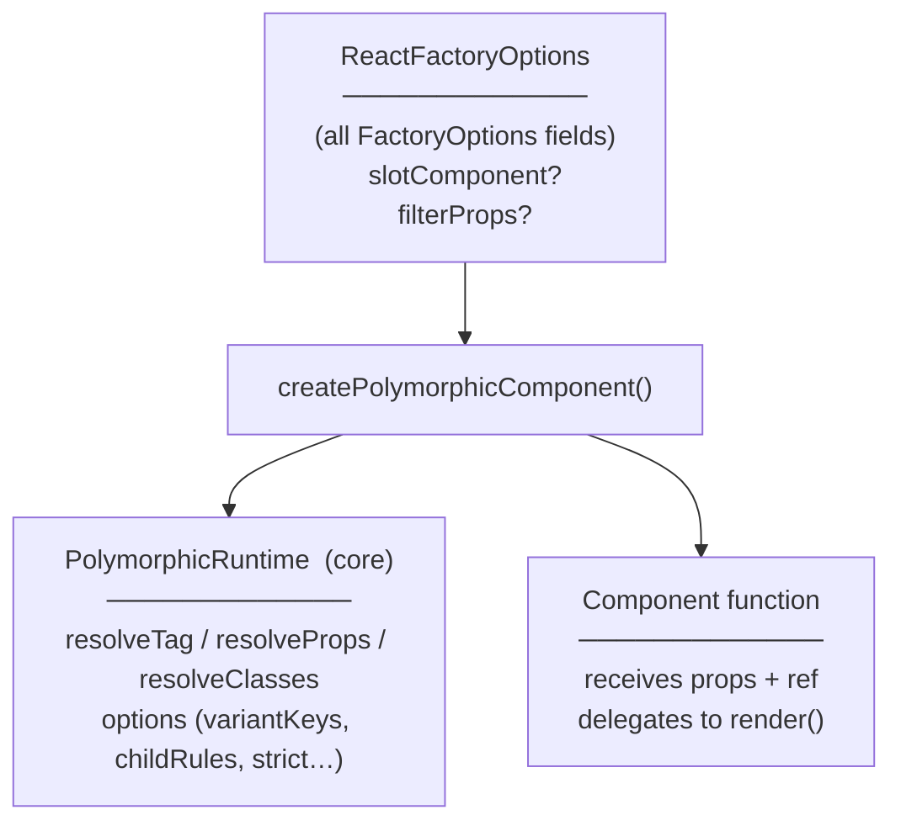
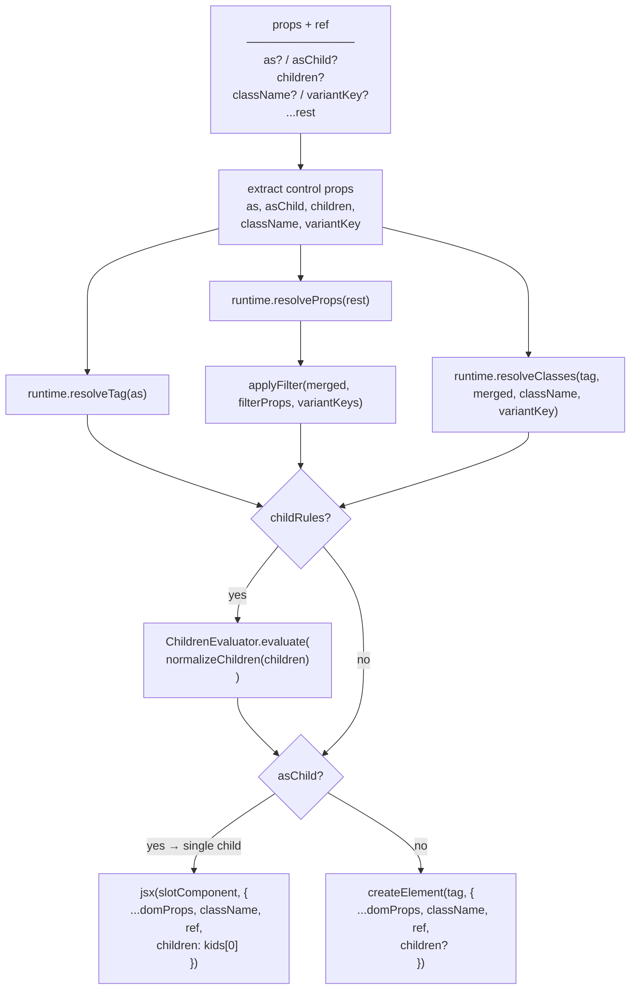
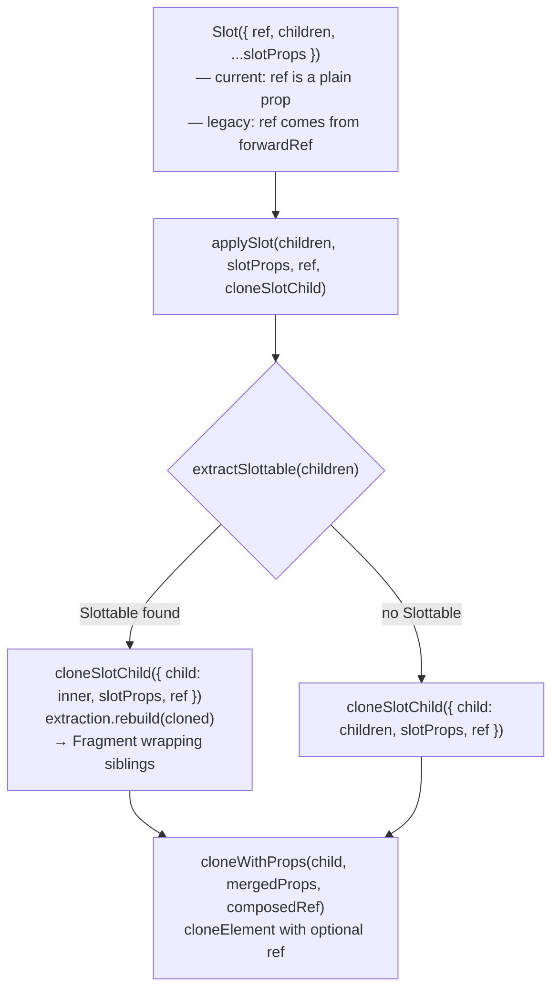

# polymorphic-ui — Architecture

---

## `@polymorphic-ui/core`

### What it is

`@polymorphic-ui/core` is a framework-agnostic TypeScript library that resolves **polymorphic
component behavior**: which HTML element or component to render (`as` prop), how to merge default
and consumer props, and how to compose class strings from variants, presets, and layout state.

It has no dependency on React, the DOM, or any specific CSS methodology.

---

### Standalone or adapter-required?

**Core is fully standalone.** Every export is usable in any JavaScript/TypeScript environment
without a framework.

A **framework adapter layer is optional but beneficial** for ergonomics:

| Concern             | Core provides                           | Adapter adds                                                      |
| ------------------- | --------------------------------------- | ----------------------------------------------------------------- |
| Tag resolution      | `resolveTag(defaultTag, as)`            | Narrows `ElementType` to the framework's element union            |
| Prop merging        | `resolveProps(props)`                   | Event handler merging, framework-specific prop normalisation      |
| Class composition   | `resolveClasses(...)`                   | CSS-methodology post-processing (e.g. `@polymorphic-ui/tailwind`) |
| Children validation | `ChildrenEvaluator.evaluate(unknown[])` | Flattens framework children before calling                        |
| ARIA validation     | `AriaPolicyEngine.validate(tag, props)` | Calls before rendering (not yet wired in the React adapter)       |
| Rendering           | —                                       | Creates and renders the resolved element                          |

The three `PolymorphicRuntime` methods (`resolveTag`, `resolveProps`, `resolveClasses`) are designed
to be called inside a component render function. `createResolverPipeline` bundles them into one call
for adapter convenience. `options` exposes the frozen resolved configuration.

---

### Source layout

```
src/
├── factory/          createPolymorphic — the main entrypoint
├── options/          resolveFactoryOptions — normalizes factory config
├── resolver/         resolveTag, resolveProps, createResolverPipeline
├── styles/           Class pipeline: CVA, static/variant resolvers
├── children/         ChildrenEvaluator — child structural constraint system
│                     RuleMatcher, RuleValidator, MatchValidator
│                     normalizeChildRule, get-type-name, match-validation-error-builder
├── validator/        AriaPolicyEngine — ARIA role validation
├── base/             StrictBase — shared strict-mode violation infrastructure
├── types/            All exported TypeScript types
└── utils/            cn (clsx wrapper), mergeProps, assertNever
```

---

### Factory entrypoint



`createPolymorphic(options)` freezes the resolved options, builds the class pipeline once, and
returns a lightweight runtime object. The pipeline instances (`StaticClassResolver`,
`VariantClassResolver`) are created once per factory call and cached for the lifetime of the
runtime.

---

### PolymorphicRuntime



#### `resolveTag`

Returns `as ?? defaultTag`. No side effects.

#### `resolveProps`

Shallow-merges `defaultProps` with the consumer's props. Consumer props win on conflict.

#### `resolveClasses`

Runs the full class pipeline (see below).

#### `options`

The frozen `ResolvedFactoryOptions`. Useful for adapters that need to inspect the factory
configuration (`variantKeys`, `childRules`, `strict`, etc.).

---

### Class pipeline

`resolveClasses` resolves the full class string by running `StaticClassResolver` and
`VariantClassResolver` in parallel, then joining with `cn()`.


CSS-methodology-specific post-processing (such as Tailwind layout-aware class filtering) is handled
by `@polymorphic-ui/tailwind`, which wraps `createClassPipeline` and applies it after the base
pipeline runs.

---

### Resolver pipeline

`createResolverPipeline` is a convenience wrapper that combines the three core resolution steps into
a single function call: `resolveTag`, `mergeProps` (defaultProps + caller props), and the class
pipeline. Children pass through unchanged. It is intended for framework adapters that want to
resolve everything in one pass; the React adapter calls the three methods directly instead.



Children pass through `createResolverPipeline` unchanged. Flattening framework children into a plain
array is the adapter's responsibility before calling `ChildrenEvaluator.evaluate`.

---

### Children constraint system

`ChildrenEvaluator` enforces structural child rules on a flat `unknown[]` children array.

#### Key types

```ts
// Cardinality is a discriminated union — unboundedness is in the type, not a sentinel.
type Cardinality = { kind: 'bounded'; min: number; max: number } | { kind: 'unbounded' }

type ChildRulePosition = 'first' | 'last' | 'any'

// Tagged phantom types prevent index confusion between child positions and rule indices.
type RuleIndex = Tagged<number, 'RuleIndex'>
type ChildIndex = Tagged<number, 'ChildIndex'>

// Bidirectional graph: forward detects unexpected/ambiguous children;
// reverse counts matches per rule for cardinality checking.
type MatchMatrix = {
  childToRules: BiDirectionalMap<ChildIndex, RuleIndex>
}
```

#### Evaluation flow



Both `RuleValidator` and `MatchValidator` extend `StrictBase` and respect the `StrictMode` setting.
The constructor invariant check (positional rule with max > 1 or unbounded) throws a `RangeError`
unconditionally — it is not gated on `strict` mode, because the configuration is structurally
impossible to ever satisfy.

---

### ARIA validator

`AriaPolicyEngine` is a standalone class — it is not embedded in `PolymorphicRuntime`. Adapters
import and instantiate it directly.

The engine uses a **snapshot diagnostic model**: all rules evaluate against the same
`(tag, props, implicitRole)` snapshot. Violations always reflect pre-fix state. Fixes are
accumulated by kind and deduplicated — at most one executor per `FixKind` runs, regardless of how
many rules emit it.

```mermaid
flowchart TD
    call["evaluate(tag, props)  [static]"]

    guard1{"tag has
implicit role?"}
    guard2{"props has
explicit role?"}

    passThrough(["return props unchanged"])

    rules["rule pipeline  [snapshot model]
─────────────
① checkInvalidRoleOverride
② checkRedundantRole
③ checkStandaloneRegion
all three evaluate same snapshot"]

    collect["collect violations + pending fixes
(deduped by FixKind)"]

    apply["apply fixes sequentially"]

    out(["return { props: fixed, violations: pre-fix }"])

    call --> guard1
    guard1 -- no --> passThrough
    guard1 -- yes --> guard2
    guard2 -- no --> passThrough
    guard2 -- yes --> rules --> collect --> apply --> out
```

`validate(tag, props)` calls `evaluate()` then routes each violation through `report()`:
`'error'`-severity violations go to `violate()` (throws or warns per `strict`); `'warning'`-severity
violations always go to `warn()` and never throw.

`ariaRolePolicy` maps six landmark elements (`article`, `aside`, `footer`, `header`, `main`, `nav`)
to their implicit ARIA roles and classifies which have strong implicit roles.

---

### Strict mode

All validation classes (`AriaPolicyEngine`, `RuleValidator`, `MatchValidator`) extend `StrictBase`,
which controls violation severity:



`violate()` respects the full range. `warn()` always caps at `console.warn` — it never throws even
when `strict: 'throw'`. `AriaPolicyEngine` routes `'warning'`-severity violations through `warn()`
so they surface in strict environments without aborting a render.

`ChildrenEvaluator` passes its `strict` setting down to both validators at construction time.

---

---

## `@polymorphic-ui/react`

`@polymorphic-ui/react` is the React adapter for core. It wraps `createPolymorphic` with
React-specific rendering, ref handling, and a Slot/Slottable protocol that implements `asChild`.

The package exports two entry points that share a common `shared/` implementation layer but differ
in how they handle refs:

| Entry point                    | Target    | Ref strategy           |
| ------------------------------ | --------- | ---------------------- |
| `@polymorphic-ui/react`        | React 19+ | `ref` as a plain prop  |
| `@polymorphic-ui/react/legacy` | React 18  | `ref` via `forwardRef` |

---

### Source tree

```
src/
├── index.ts              re-exports current/
├── current/              React 19 implementation
│   ├── create-polymorphic-component.ts
│   ├── normalize-children.ts
│   └── slot/
│       ├── Slot.tsx          thin shell: destructures ref as plain prop
│       ├── cloneSlotChild.ts React 19 ref extraction + element cloning
│       ├── composeRefs.ts    getChildRef (reads props.ref) + composeRefs alias
│       └── index.ts          exports Slot only
├── legacy/               React 18 implementation (forwardRef wrappers)
│   ├── create-polymorphic-component.ts
│   ├── normalize-children.ts
│   └── slot/
│       ├── Slot.tsx          thin shell: forwardRef wrapper
│       ├── cloneSlotChild.ts React 18 ref extraction + element cloning
│       ├── composeRefs.ts    getChildRef (reads element.ref) + composeRefs alias
│       └── index.ts          exports Slot only
└── shared/               behavioral contract shared by both versions
    ├── polymorphic-props.ts  PolymorphicProps, PolymorphicComponent, ElementRef
    ├── react-options.ts      ReactFactoryOptions (extends core FactoryOptions)
    ├── render.ts             shared render() function
    ├── merge-refs.ts         mergeRefs utility
    ├── types.ts              AnyRuntime, AnyRuntimeOptions, resolver interfaces
    └── slot/
        ├── Slottable.tsx       marker component; renders as Fragment
        ├── applySlot.ts        orchestration: extract → clone → rebuild
        ├── extractSlottable.ts scan children for Slottable; return extraction + rebuild
        ├── clone.ts            cloneWithProps — cloneElement with optional ref
        ├── mergeProps.ts       prop merge dispatcher
        ├── policies.ts         chain / concat / shallow-merge / child-wins handlers
        ├── predicates.ts       isSlottableElement, isReactEventKey, isFunction, isPlainObject
        ├── slot-validator.ts   SlotValidator (extends StrictBase) for asChild invariants
        ├── invariant.ts        hard-throw assertion helpers
        ├── constants.ts        SLOT_NAME, EVENT_HANDLER_RE
        └── types.ts            EventHandler, MergePolicyHandler, SlotProps, CloneSlotChildFn
```

---

### `createPolymorphicComponent`

Wraps `createPolymorphic` from core and returns a typed React component. The factory is called once;
`PolymorphicRuntime` is captured in the closure and reused on every render.



`slotComponent` defaults to the version-local `Slot`. `filterProps` lets the caller strip
variant-key props (and any other implementation-detail props) from the DOM before rendering.

---

### Render pipeline

`render()` in `shared/render.ts` is the single shared render path for both React versions.



`SlotValidator` enforces three invariants during render (respecting `strict` mode): mutual
exclusivity of `as` and `asChild`; exactly one element child when `asChild` is set; non-element
children are warned and discarded.

---

### Slot protocol

The `asChild` slot system is implemented as a two-layer protocol. `shared/slot/` owns the behavioral
contract; each version-specific `Slot.tsx` is a thin shell whose only version-specific
responsibility is ref extraction.



**`Slottable`** is a marker component that renders as a `Fragment`. Detection is by reference
equality (`child.type === Slottable`), not a symbol — no serialization, no context required.

**`extractSlottable`** enforces its own hard-throw invariants (not `strict`-gated):

- More than one `<Slottable>` sibling → throw
- `null` / `undefined` child inside `<Slottable>` → throw
- String or number child → throw
- Fragment child → throw

**`cloneSlotChild`** is injected into `applySlot` as `CloneSlotChildFn`. Each version supplies its
own implementation; `shared/` never imports a version-specific module.

**Ref composition** (`composeRefs.ts`): React 19 stores ref in `element.props.ref`; React 18 stores
it in `element.ref`. When elements cross React version boundaries, one location carries a warning
getter. `getChildRef` detects the live location by inspecting property descriptors, then
`composeRefs` (aliased from `mergeRefs`) combines the child's existing ref with the slot ref.

---

### Prop merge policies

When slot props and child props share a key, `mergeProps` in `shared/slot/mergeProps.ts` classifies
the key and dispatches to a policy handler:

| Policy          | Trigger                                  | Behavior                                          |
| --------------- | ---------------------------------------- | ------------------------------------------------- |
| `chain`         | Both values are functions + key is `on*` | Child first; slot fires unless `defaultPrevented` |
| `concat`        | key is `className`                       | Slot classes precede child classes                |
| `shallow-merge` | key is `style`                           | Spread; child wins on key conflicts               |
| `child-wins`    | everything else                          | Child value replaces slot value                   |

---

### `PolymorphicProps` type

```ts
type PolymorphicProps<TDefault, Props, Variants, TPreset, TAs = TDefault> = Omit<
  IntrinsicJSXProps<TAs>,
  keyof ControlProps<TAs, Props, Variants, TPreset>
> &
  ControlProps<TAs, Props, Variants, TPreset>
```

`Omit + intersection` is used instead of `Merge` from type-fest. `Merge` produces a flat mapped type
that TypeScript cannot see through for generic inference — `as="a"` would be rejected when the
default tag is `"button"` because `TAs` could never be inferred. The `Omit + intersection` form
keeps `as?: TAs` visible to the inference engine.

`Simplify` is deliberately absent — it converts intersections to mapped types, which weakens
excess-property checking.

`ControlProps` is a separate helper type so it can be used both as the right side of the
intersection and as the `keyof` argument to `Omit` without repeating the shape.

---

### `normalizeChildren`

The two versions differ in how they flatten children:

- **`current/`** — direct `isValidElement` check + `Array.filter`. Does not traverse Fragment
  boundaries. A Fragment passed as the sole `asChild` child is treated as one opaque element and
  fails the single-element validation rather than being silently flattened.
- **`legacy/`** — `Children.toArray` (React 18 API). Traverses Fragment boundaries, matching React
  18 expectations.
