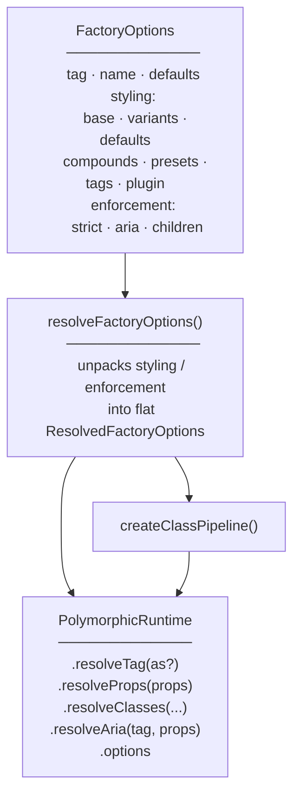
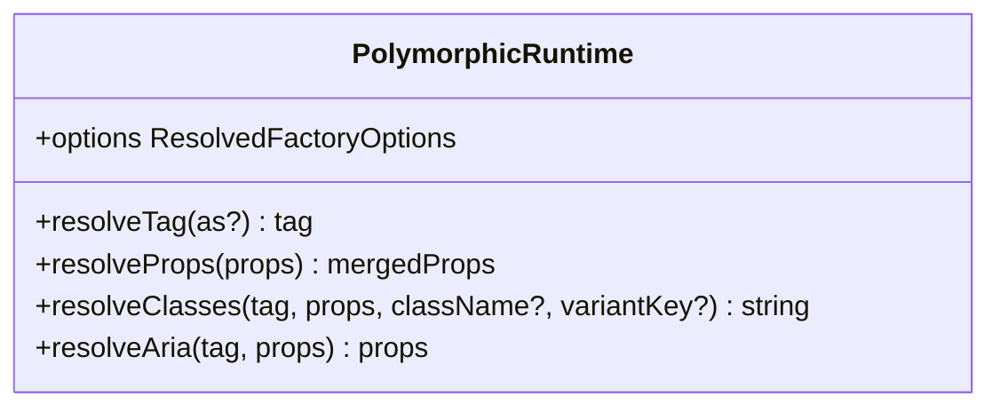
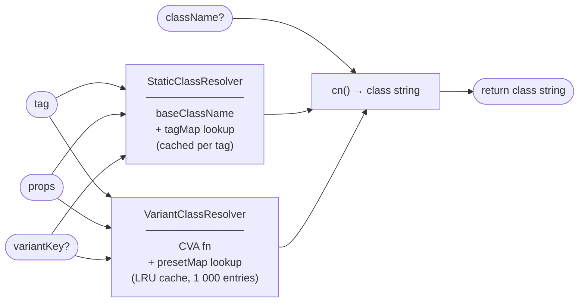
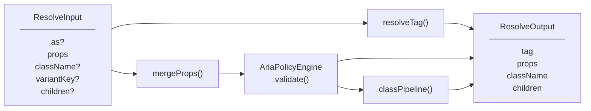
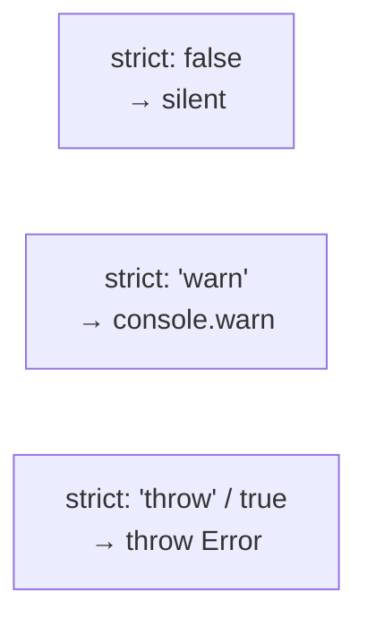
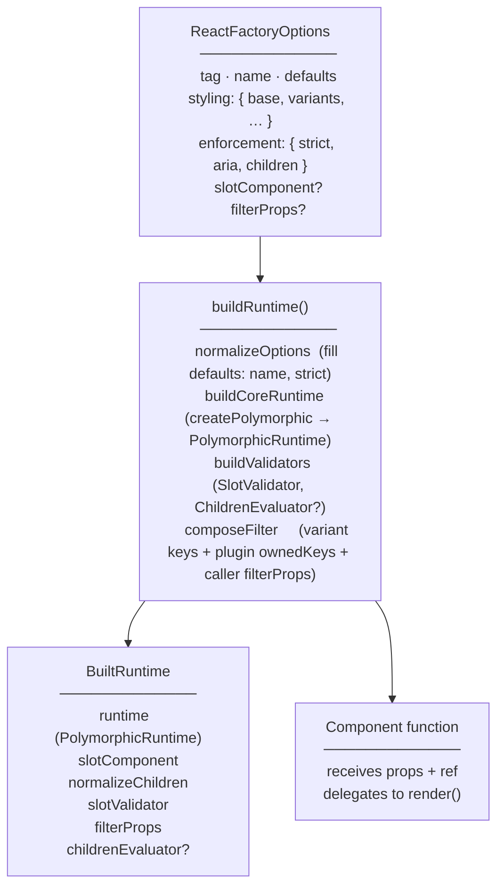
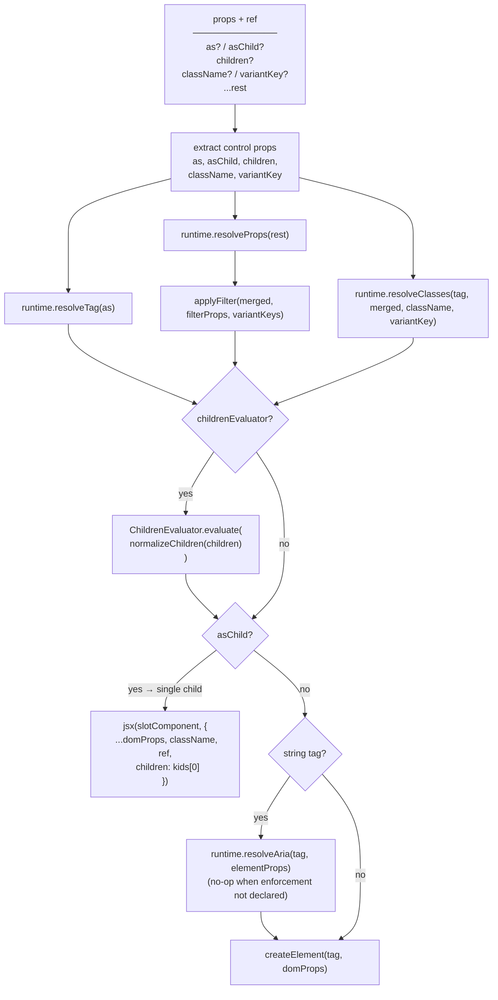
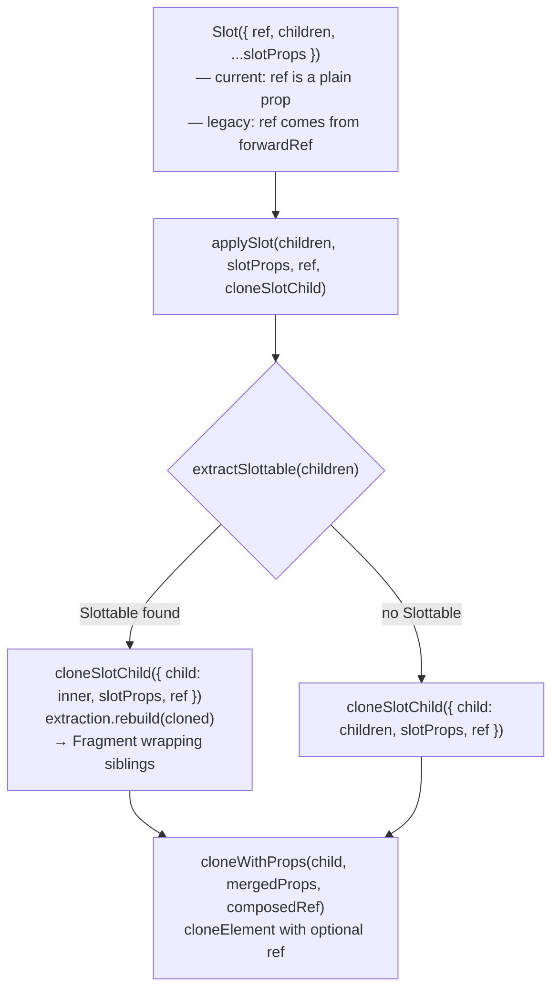

# polymorphic-ui — Architecture

---

## Workspace layout

The repository is a pnpm workspace split into two roots:

```text
lib/                     internal implementation modules (private: true, not published)
  primitive/             tag resolution, prop merge, slot protocol (zero framework deps)
  contract/              ARIA engine, children validator, strict mode base
  styling/               variant resolver, class pipeline, plugin API
  adapter-utils/         shared logic used by all framework adapters
  bench/                 benchmark suites

packages/                published artifacts (versioned, npm-facing)
  core/                  capability-driven factory composing lib/ modules
  react/                 React 19+ adapter; /legacy sub-path for React 18
  vue/                   Vue 3 adapter
  preact/                Preact adapter
  solid/                 Solid adapter
  svelte/                Svelte 5 adapter
  tailwind/              Tailwind layout-aware class pipeline plugin
  docs/                  cross-framework integration tests
```

Dependency direction: `lib/primitive` ← `lib/contract` ← `lib/styling` ← `packages/core` ←
`lib/adapter-utils` ← `packages/<adapter>`. Dependencies flow upward only. `pnpm arch:validate`
enforces these rules via `dependency-cruiser`.

---

## `@polymorphic-ui/core`

### What it is

`@polymorphic-ui/core` is a framework-agnostic TypeScript library that resolves **polymorphic
component behavior**: which HTML element or component to render (`as` prop), how to merge default
and consumer props, and how to compose class strings from variants, presets, and layout state.

It has no dependency on React, the DOM, or any specific CSS methodology.

---

### Standalone or adapter-required?

**Core is fully standalone.** Every export is usable in any JavaScript/TypeScript environment
without a framework.

A **framework adapter layer is optional but beneficial** for ergonomics:

| Concern             | Core provides                                                          | Adapter adds                                                      |
| ------------------- | ---------------------------------------------------------------------- | ----------------------------------------------------------------- |
| Tag resolution      | `resolveTag(defaultTag, as)`                                           | Narrows `ElementType` to the framework's element union            |
| Prop merging        | `resolveProps(props)`                                                  | Event handler merging, framework-specific prop normalisation      |
| Class composition   | `resolveClasses(...)`                                                  | CSS-methodology post-processing (e.g. `@polymorphic-ui/tailwind`) |
| Children validation | `ChildrenEvaluator.evaluate(unknown[])`                                | Flattens framework children before calling                        |
| ARIA validation     | `AriaPolicyEngine` wired into `resolveAria` / `createResolverPipeline` | Strips invalid `aria-*` attrs; reports violations via strict mode |
| Rendering           | —                                                                      | Creates and renders the resolved element                          |

The four `PolymorphicRuntime` methods (`resolveTag`, `resolveProps`, `resolveClasses`,
`resolveAria`) are designed to be called inside a component render function.
`createResolverPipeline` bundles them into one call for adapter convenience. `options` exposes the
frozen resolved configuration.

---

### Source layout

`packages/core/src/` is a thin capability-driven factory. The implementation lives in `lib/`:

```text
lib/primitive/src/
├── resolve-tag.ts        as-prop dispatch
├── merge-props.ts        prop merge with event chaining
└── slot/                 slot protocol (mergeProps, applySlot, Slottable)

lib/contract/src/
├── aria/                 AriaPolicyEngine — implicit role map, attribute policy, engine
├── children/             ChildrenEvaluator — RuleMatcher, RuleValidator, MatchValidator
└── base/                 StrictBase — warn() / violate() routing

lib/styling/src/
├── class-pipeline.ts     createClassPipeline — StaticClassResolver + VariantClassResolver
├── variant-resolver.ts   CVA integration, LRU cache
└── plugin/               ClassPlugin API

lib/adapter-utils/src/
├── build-core-runtime.ts buildCoreRuntime — calls createPolymorphic, extracts ownedKeys
├── build-engines.ts      buildEngines — ChildrenEvaluator construction
├── compose-filter.ts     composeFilter — merges plugin + user filterProps predicates
└── slot/                 SlotValidator — asChild invariant enforcement

packages/core/src/
├── factory/              createPolymorphic — capability-driven factory
└── options/              resolveFactoryOptions — unpacks FactoryOptions into flat shape
```

---

### Factory entrypoint



`createPolymorphic(options)` unpacks the namespaced `FactoryOptions` into a flat
`ResolvedFactoryOptions` (internal field names are unchanged), freezes it, builds the class pipeline
once, and returns a lightweight runtime object. The pipeline instances (`StaticClassResolver`,
`VariantClassResolver`) are created once per factory call and cached for the lifetime of the
runtime.

---

### PolymorphicRuntime



#### `resolveTag`

Returns `as ?? defaultTag`. No side effects.

#### `resolveProps`

Shallow-merges `defaultProps` with the consumer's props. Consumer props win on conflict.

#### `resolveClasses`

Runs the full class pipeline (see below).

#### `options`

The frozen `ResolvedFactoryOptions`. Useful for adapters that need to inspect the factory
configuration (`variantKeys`, `childRules`, `strict`, etc.).

---

### Class pipeline

`resolveClasses` resolves the full class string by running `StaticClassResolver` and
`VariantClassResolver` in parallel, then joining with `cn()`.



CSS-methodology-specific post-processing (such as Tailwind layout-aware class filtering) is handled
by `@polymorphic-ui/tailwind`, which wraps `createClassPipeline` and applies it after the base
pipeline runs.

---

### Resolver pipeline

`createResolverPipeline` is a convenience wrapper that combines the four core resolution steps into
a single function call: `resolveTag`, `mergeProps` (defaultProps + caller props), ARIA validation,
and the class pipeline. Children pass through unchanged. It is intended for framework adapters that
want to resolve everything in one pass; the React adapter calls the runtime methods directly
instead.



Children pass through `createResolverPipeline` unchanged. Flattening framework children into a plain
array is the adapter's responsibility before calling `ChildrenEvaluator.evaluate`.

---

### Children constraint system

`ChildrenEvaluator` enforces structural child rules on a flat `unknown[]` children array.

#### Key types

```ts
// Cardinality is a discriminated union — unboundedness is in the type, not a sentinel.
type Cardinality = { kind: 'bounded'; min: number; max: number } | { kind: 'unbounded' }

type ChildRulePosition = 'first' | 'last' | 'any'

// Tagged phantom types prevent index confusion between child positions and rule indices.
type RuleIndex = Tagged<number, 'RuleIndex'>
type ChildIndex = Tagged<number, 'ChildIndex'>

// Bidirectional graph: forward detects unexpected/ambiguous children;
// reverse counts matches per rule for cardinality checking.
type MatchMatrix = {
  childToRules: BiDirectionalMap<ChildIndex, RuleIndex>
}
```

#### Evaluation flow


Both `RuleValidator` and `MatchValidator` extend `StrictBase` and respect the `StrictMode` setting.
The constructor invariant check (positional rule with max > 1 or unbounded) throws a `RangeError`
unconditionally — it is not gated on `strict` mode, because the configuration is structurally
impossible to ever satisfy.

---

### ARIA validator

`AriaPolicyEngine` is instantiated inside `createPolymorphic` only when `enforcement` is declared in
the factory options. When no `enforcement` key is present the engine is not created and
`runtime.resolveAria(tag, props)` returns `{ props }` unchanged. This is the capability-driven gate:
primitive-only components pay no ARIA overhead at runtime or in the bundle.

The engine uses a **snapshot diagnostic model**: all rules evaluate against the same
`(tag, props, implicitRole)` snapshot. Violations always reflect pre-fix state. Fixes are
accumulated by kind and deduplicated — at most one executor per `FixKind` runs, regardless of how
many rules emit it.

```mermaid
flowchart TD
    call["evaluate(tag, props)  [static]"]

    guard1{"tag has
implicit role?"}
    guard2{"props has
explicit role?"}

    passThrough(["return props unchanged"])

    rules["rule pipeline  [snapshot model]
─────────────
① checkInvalidRoleOverride
② checkRedundantRole
③ checkStandaloneRegion
④ checkInvalidAriaAttributes
all four evaluate same snapshot"]

    collect["collect violations + pending fixes
(deduped by FixKind)"]

    apply["apply fixes sequentially"]

    out(["return { props: fixed, violations: pre-fix }"])

    call --> guard1
    guard1 -- no --> passThrough
    guard1 -- yes --> guard2
    guard2 -- no --> rules
    guard2 -- yes --> rules
    rules --> collect --> apply --> out
```

`validate(tag, props)` calls `evaluate()` then routes each violation through `report()`:
`'error'`-severity violations go to `violate()` (throws or warns per `strict`); `'warning'`-severity
violations always go to `warn()` and never throw.

`ariaRolePolicy` maps 19 elements (6 landmark + 13 interactive/structural) to their implicit ARIA
roles and classifies which have strong implicit roles. `aria-attribute-policy` holds the curated
maps of global and role-restricted `aria-*` attributes used by `checkInvalidAriaAttributes`.

---

### Strict mode

All validation classes (`AriaPolicyEngine`, `RuleValidator`, `MatchValidator`) extend `StrictBase`,
which controls violation severity:



`violate()` respects the full range. `warn()` always caps at `console.warn` — it never throws even
when `strict: 'throw'`. `AriaPolicyEngine` routes `'warning'`-severity violations through `warn()`
so they surface in strict environments without aborting a render.

`ChildrenEvaluator` passes its `strict` setting down to both validators at construction time.

---

---

## `@polymorphic-ui/react`

`@polymorphic-ui/react` is the React adapter for core. It wraps `createPolymorphic` with
React-specific rendering, ref handling, and a Slot/Slottable protocol that implements `asChild`.

The package exports two entry points that share a common `shared/` implementation layer but differ
in how they handle refs:

| Entry point                    | Target    | Ref strategy           |
| ------------------------------ | --------- | ---------------------- |
| `@polymorphic-ui/react`        | React 19+ | `ref` as a plain prop  |
| `@polymorphic-ui/react/legacy` | React 18  | `ref` via `forwardRef` |

---

### Source tree

```text
src/
├── index.ts              re-exports current/
├── current/              React 19 implementation
│   ├── create-polymorphic-component.ts
│   ├── normalize-children.ts
│   └── slot/
│       ├── Slot.tsx          thin shell: destructures ref as plain prop
│       ├── cloneSlotChild.ts React 19 ref extraction + element cloning
│       ├── composeRefs.ts    getChildRef (reads props.ref) + composeRefs alias
│       └── index.ts          exports Slot only
├── legacy/               React 18 implementation (forwardRef wrappers)
│   ├── create-polymorphic-component.ts
│   ├── normalize-children.ts
│   └── slot/
│       ├── Slot.tsx          thin shell: forwardRef wrapper
│       ├── cloneSlotChild.ts React 18 ref extraction + element cloning
│       ├── composeRefs.ts    getChildRef (reads element.ref) + composeRefs alias
│       └── index.ts          exports Slot only
└── shared/               behavioral contract shared by both versions
    ├── build-runtime.ts      buildRuntime — wires core runtime + React concerns into BuiltRuntime
    ├── react-options.ts      ReactFactoryOptions (extends core FactoryOptions)
    ├── render.ts             shared render() function
    ├── apply-display-name.ts applyDisplayName utility
    ├── compose-filter.ts     composeFilter — builds the prop-filtering predicate
    ├── merge-refs.ts         mergeRefs utility
    ├── types.ts              barrel shim — re-exports from types/
    ├── types/
    │   ├── primitives.ts       UnknownProps, SlotComponent, ResolvedProps, FilterPredicate, …
    │   ├── props.ts            AsProp, AsChildProp, PolymorphicPropsBase, KnownProps
    │   ├── render.ts           RenderDirectives, ResolvedRenderState, RenderInput, …
    │   ├── runtime.ts          Runtime, TypedRuntime, RuntimeOptions, resolver interfaces
    │   ├── built-runtime.ts    BuiltRuntime, BuiltChildrenEvaluator, WithChildRules
    │   ├── normalized-options.ts NormalizedOptions
    │   └── polymorphic-props.ts  PolymorphicProps, PolymorphicWithAsChild, PolymorphicComponent, ElementRef
    └── slot/
        ├── Slottable.tsx       marker component; renders as Fragment
        ├── applySlot.ts        orchestration: extract → clone → rebuild
        ├── extractSlottable.ts scan children for Slottable; return extraction + rebuild
        ├── clone.ts            cloneWithProps — cloneElement with optional ref
        ├── mergeProps.ts       prop merge dispatcher
        ├── policies.ts         chain / concat / shallow-merge / child-wins handlers
        ├── predicates.ts       isSlottableElement, isReactEventKey, isFunction, isPlainObject
        ├── slot-validator.ts   SlotValidator (extends StrictBase) for asChild invariants
        ├── invariant.ts        hard-throw assertion helpers
        ├── constants.ts        SLOT_NAME, EVENT_HANDLER_RE
        └── types.ts            EventHandler, MergePolicyHandler, SlotProps, CloneSlotChildFn
```

---

### `createPolymorphicComponent`

Calls `buildRuntime` once at factory time and returns a typed React component that holds the
resulting `BuiltRuntime` bundle in its closure.



`slotComponent` defaults to the version-local `Slot`. `filterProps` lets the caller strip
variant-key props (and any other implementation-detail props) from the DOM before rendering.
`ChildrenEvaluator` is only instantiated when `enforcement.children` is present in the options.

---

### Render pipeline

`render()` in `shared/render.ts` is the single shared render path for both React versions.



`SlotValidator` enforces three invariants during render (respecting `strict` mode): mutual
exclusivity of `as` and `asChild`; exactly one element child when `asChild` is set; non-element
children are warned and discarded.

ARIA validation (`runtime.resolveAria`) runs only for intrinsic string tags. Component types
(`as={MyComponent}`) pass through without validation — there is no implicit ARIA role to check. When
`enforcement` was not declared the call is a no-op regardless of tag type.

---

### Slot protocol

The `asChild` slot system is implemented as a two-layer protocol. `shared/slot/` owns the behavioral
contract; each version-specific `Slot.tsx` is a thin shell whose only version-specific
responsibility is ref extraction.



**`Slottable`** is a marker component that renders as a `Fragment`. Detection is by reference
equality (`child.type === Slottable`), not a symbol — no serialization, no context required.

**`extractSlottable`** enforces its own hard-throw invariants (not `strict`-gated):

- More than one `<Slottable>` sibling → throw
- `null` / `undefined` child inside `<Slottable>` → throw
- String or number child → throw
- Fragment child → throw

**`cloneSlotChild`** is injected into `applySlot` as `CloneSlotChildFn`. Each version supplies its
own implementation; `shared/` never imports a version-specific module.

**Ref composition** (`composeRefs.ts`): React 19 stores ref in `element.props.ref`; React 18 stores
it in `element.ref`. When elements cross React version boundaries, one location carries a warning
getter. `getChildRef` detects the live location by inspecting property descriptors, then
`composeRefs` (aliased from `mergeRefs`) combines the child's existing ref with the slot ref.

---

### Prop merge policies

When slot props and child props share a key, `mergeProps` in `shared/slot/mergeProps.ts` classifies
the key and dispatches to a policy handler:

| Policy          | Trigger                                  | Behavior                                          |
| --------------- | ---------------------------------------- | ------------------------------------------------- |
| `chain`         | Both values are functions + key is `on*` | Child first; slot fires unless `defaultPrevented` |
| `concat`        | key is `className`                       | Slot classes precede child classes                |
| `shallow-merge` | key is `style`                           | Spread; child wins on key conflicts               |
| `child-wins`    | everything else                          | Child value replaces slot value                   |

---

### `PolymorphicGenerics` bundle

`PolymorphicGenerics<TDefault, Props, Variants, TPreset>` is an interface that bundles the four
recurring generic parameters into a single type variable `G`:

```ts
interface PolymorphicGenerics<TDefault, Props, Variants, TPreset> {
  default: TDefault
  props: Props
  variants: Variants
  preset: TPreset
}
// Accessor types
type DefaultOf<G> = G['default']
type PropsOf<G> = G['props']
type VariantsOf<G> = G['variants']
type PresetOf<G> = G['preset']
```

Internal helpers use `G extends PolymorphicGenerics` to avoid repeating the four-parameter chain.
Public factory functions (`createPolymorphic`, `createPolymorphicComponent`, `buildRuntime`) keep
individual parameters so TypeScript can infer each one from the call-site options literal.

---

### `PolymorphicProps` type

```ts
type PolymorphicProps<
  G extends PolymorphicGenerics,
  TAs extends ElementType = DefaultOf<G>,
> = Simplify<SharedProps<G, TAs> & { asChild?: false; children?: ReactNode }>
```

`Omit + intersection` is used for `SharedProps` instead of `Merge` from type-fest. `Merge` produces
a flat mapped type that TypeScript cannot see through for generic inference — `as="a"` would be
rejected when the default tag is `"button"` because `TAs` could never be inferred. The
`Omit + intersection` form keeps `as?: TAs` visible to the inference engine.

`Simplify` is applied at the outermost level only (on the exported `PolymorphicProps` and
`PolymorphicWithAsChild` types) to flatten the intersection for IDE hover readability. It is not
applied to `SharedProps` or `ControlProps` because those are intermediate types used inside `Omit`
and intersection — flattening them at that level would break excess-property checking.

`ControlProps` is a separate helper type so it can be used both as the right side of the
intersection and as the `keyof` argument to `Omit` without repeating the shape.

---

### `normalizeChildren`

The two versions differ in how they flatten children:

- **`current/`** — direct `isValidElement` check + `Array.filter`. Does not traverse Fragment
  boundaries. A Fragment passed as the sole `asChild` child is treated as one opaque element and
  fails the single-element validation rather than being silently flattened.
- **`legacy/`** — `Children.toArray` (React 18 API). Traverses Fragment boundaries, matching React
  18 expectations.

---

## Debugging

### Why a class wasn't applied

The class pipeline is additive — it never removes classes. If an expected class is absent, the cause
is one of three things:

**Compound variant didn't fire.** Every key in a compound's conditions must match the effective
variant props (defaults → preset → caller). Use `diagnoseClassPipeline` to trace each compound:

```ts
import { diagnoseClassPipeline } from '@polymorphic-ui/core/styling'

const trace = diagnoseClassPipeline(
  options, // same ClassPipelineOptions passed to createPolymorphicComponent
  'button', // rendered tag
  { size: 'sm' }, // variant props after filterProps
)

trace.compounds
// [
//   {
//     conditions: { size: 'sm', intent: 'primary' },
//     class: 'btn--sm-primary',
//     fired: false,
//     mismatches: [{ key: 'intent', expected: 'primary', got: undefined }]
//   }
// ]

trace.effectiveVariants
// { size: 'sm' }  — what CVA sees: defaults merged with preset merged with caller props
```

**Tag-map class was bypassed.** `styling.tags` entries are skipped when a preset (`variantKey`) is
active, because the preset owns the visual treatment. `tagMapBypassed: true` in the trace confirms
this, and `tagMapClass` shows what would have been added:

```ts
trace.tagMapBypassed // true
trace.tagMapClass // 'btn--link' — the class that was skipped
```

**Preset key not found.** If `variantKey` doesn't match any key in `styling.presets`, the preset
silently resolves to empty. The trace reports `presetValues: null`:

```ts
trace.presetKey // 'ghost'
trace.presetValues // null — key not found in presetMap
```

---

### Why a role was stripped

The ARIA engine already explains every decision through `ValidationResult.violations`. Set
`enforcement.strict: 'warn'` to surface the messages as `console.warn` during development:

```ts
createPolymorphicComponent({
  tag: 'nav',
  enforcement: { strict: 'warn', aria: [...] },
})
```

Or call the engine directly to inspect violations without enforcement side-effects:

```ts
import { AriaPolicyEngine } from '@polymorphic-ui/core/contract'

const result = AriaPolicyEngine.evaluate('nav', { role: 'navigation' })
result.violations
// [
//   {
//     message: '<nav> already has implicit role="navigation". Avoid redundant role assignment.',
//     tag: 'nav',
//     role: 'navigation',
//     attribute: undefined,
//     severity: 'warning',
//     phase: 'evaluate',
//   }
// ]
```

Every violation includes `severity` (`'warning'` | `'error'`), `phase`, the affected `tag`, `role`,
and optionally `attribute` (for invalid `aria-*` removals). Violations with `fixable: true` have a
corresponding fix already applied to `result.props`.

Common messages:

| Situation                       | Message pattern                                                                  |
| ------------------------------- | -------------------------------------------------------------------------------- |
| Redundant explicit role         | `<nav> already has implicit role="navigation". Avoid redundant role assignment.` |
| Strong implicit role overridden | `<button> should not override its implicit role="button" with role="region".`    |
| Invalid `aria-*` for role       | `"aria-checked" is not valid on role="navigation". It will be removed.`          |
| Empty `role=""`                 | `<nav> has an explicit empty role="". Omit the attribute instead.`               |

---

### Why a child rule failed

The children evaluator routes all violations through `StrictBase`, which controls whether they throw
or warn. Set `enforcement.strict: 'warn'` to see messages without aborting a render:

```ts
createPolymorphicComponent({
  tag: 'ul',
  enforcement: {
    strict: 'warn',
    children: [{ name: 'Item', match: (c) => isValidElement(c) && c.type === 'li' }],
  },
})
```

Message patterns:

| Violation              | Message                                                                 |
| ---------------------- | ----------------------------------------------------------------------- |
| Below minimum          | `ButtonGroup: "Icon" requires at least 1.`                              |
| Above maximum          | `ButtonGroup: "Icon" allows at most 3.`                                 |
| Position wrong         | `ButtonGroup: "Icon" must be first, got index 2`                        |
| No rule matched        | `ButtonGroup: unexpected child [string] at index 0`                     |
| Matched multiple rules | `ButtonGroup: [element] at index 0 matches multiple rules: Icon, Label` |

The component name comes from the `name` option passed to `createPolymorphicComponent`. Rule names
come from each `ChildRuleInput.name` field. The `[string]` / `[element]` / `[null]` notation in
unexpected-child and multi-match messages comes from `getTypeName`, which classifies the child's
runtime type for readability.
