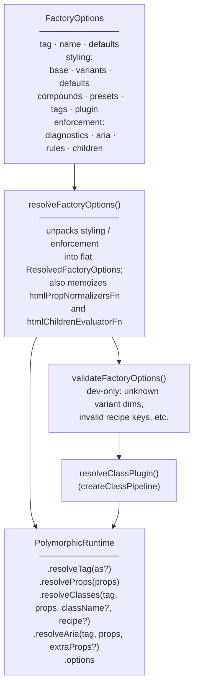
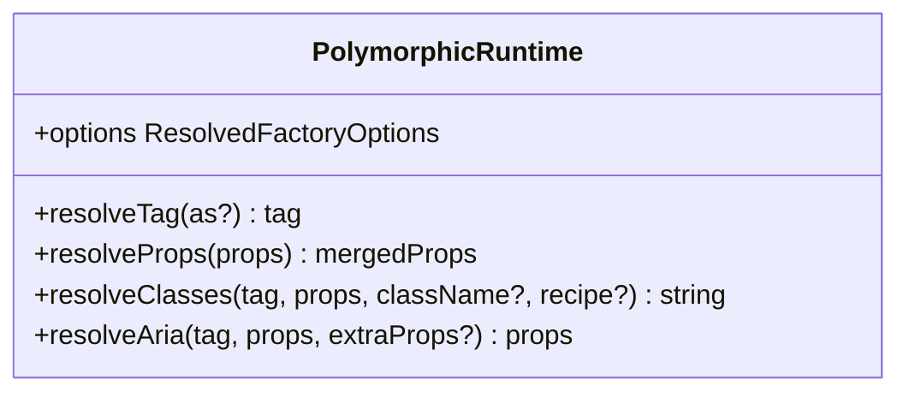
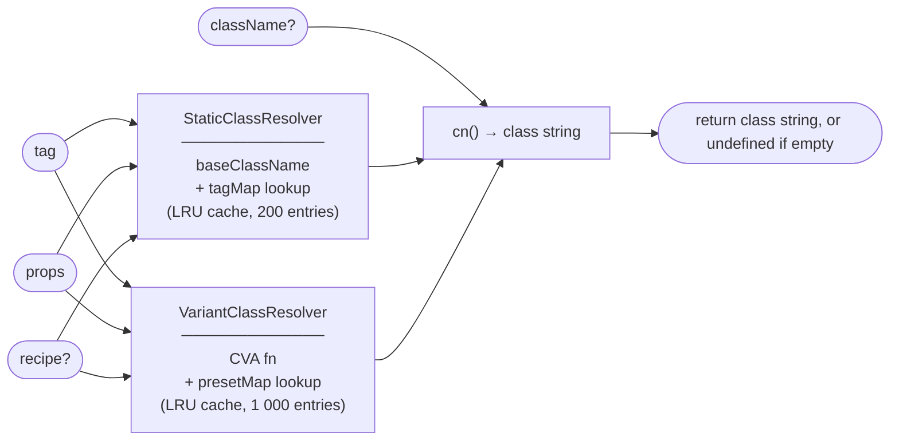
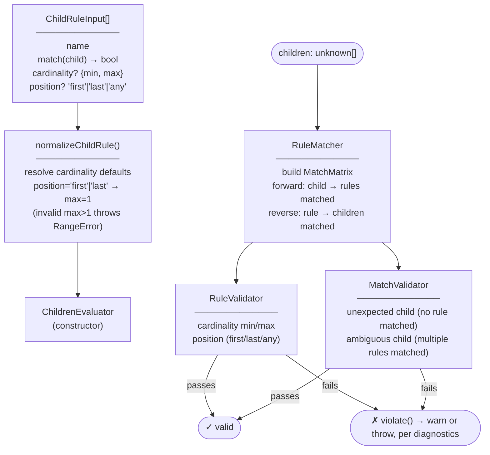
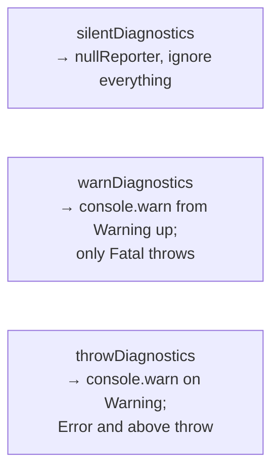
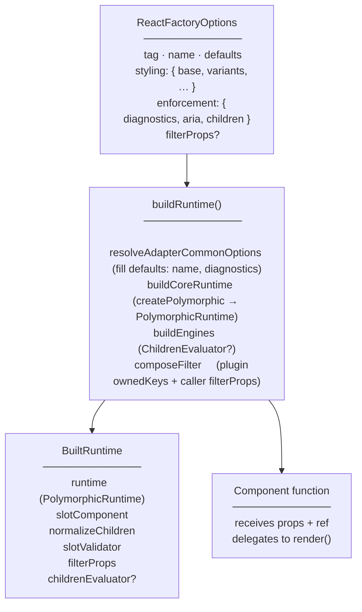
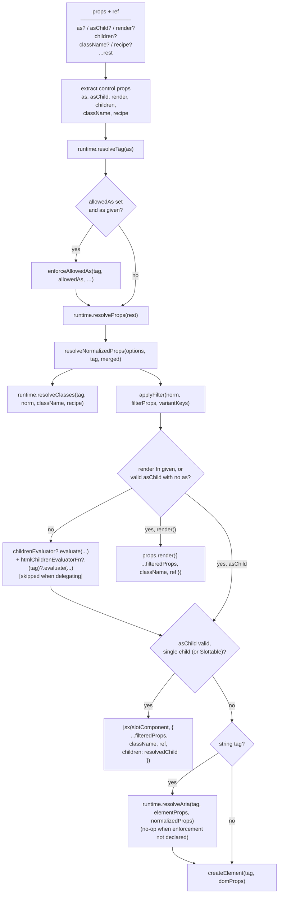
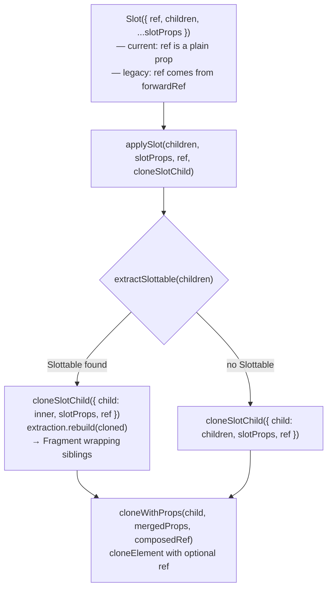

# praxis-kit — Architecture

---

## Workspace layout

The repository is a pnpm workspace of four roots:

```text
lib/                     internal implementation modules (private: true, not published)
  primitive/             tag resolution, prop/rule merging, LRU cache, type-guard/constant foundations
  contract/              ARIA engine, children validator, InvariantBase, diagnostic message factories
  contract-props/        small mode/generics-detection helpers shared by contract consumers
  styling/               variant resolver (CVA), class pipeline, class-plugin API
  diagnostics/           the Diagnostics class, severity/policy model, reporters, silent/warn/throw presets
  adapter-utils/         shared logic used by every framework adapter (runtime wiring, prop
                         normalization, slot validation, SSR host-state, testing harness)
  runtime/               tree/render-context primitives backing the Custom Element adapters
  pipeline/ pipeline-kit/ generic compose/run/pass abstractions used by a few of the above
  tailwind/              Tailwind layout-aware class pipeline (built for @praxis-kit/tailwind)
  playwright/            shared Playwright fixtures for adapter interaction tests

packages/                published artifacts (versioned, npm-facing)
  core/                  capability-driven factory (createPolymorphic) composing lib/ modules
  kit/                   praxis-kit — the single umbrella package end users install; re-exports
                         every adapter and lib/tailwind under one package with per-framework
                         subpath exports (see packages/kit's own README)

adapters/                framework adapters — react, preact, vue, solid, svelte, lit, web
                         (source-consumed within the workspace; packages/kit's build is what
                         compiles them for publishing — no adapter has its own build step)

plugins/                 eslint-plugin and the TypeScript language-service plugin
tooling/                 the praxis-codemod CLI
qa/                      cross-cutting verification: tree-shaking tests, conformance harness, bench
```

Dependency direction: `lib/primitive` ← `lib/contract`/`lib/styling`/`lib/diagnostics` ←
`packages/core` ← `lib/adapter-utils` ← `adapters/<framework>`. Dependencies flow upward only,
enforced by `eslint-plugin-boundaries` via the root `eslint.config.ts` + `configs/architecture.ts`
(not `dependency-cruiser` — this repo has no `.dependency-cruiser.cjs`).

---

## `@praxis-kit/core`

### What it is

`@praxis-kit/core` is a framework-agnostic TypeScript library that resolves **polymorphic component
behavior**: which HTML element or component to render (`as` prop), how to merge default and consumer
props, and how to compose class strings from variants, presets (selected via the `recipe` prop), and
layout state.

It has no dependency on React, the DOM, or any specific CSS methodology.

---

### Standalone or adapter-required?

Core is fully standalone — every export works in any JavaScript environment without a framework.

A framework adapter is optional:

| Concern             | Core provides                                                             | Adapter adds                                                                                                                      |
| ------------------- | ------------------------------------------------------------------------- | --------------------------------------------------------------------------------------------------------------------------------- |
| Tag resolution      | `resolveTag(defaultTag, as)`                                              | Narrows `ElementType` to the framework's element union                                                                            |
| Prop merging        | `resolveProps(props)`                                                     | HTML-normalizer + `normalize` composition, event handler merging (`resolveNormalizedProps`, in `lib/adapter-utils`)               |
| Class composition   | `resolveClasses(tag, props, className?, recipe?)`                         | CSS-methodology post-processing (e.g. `@praxis-kit/tailwind`)                                                                     |
| Children validation | `ChildrenEvaluator.evaluate(unknown[])`                                   | Flattens framework children before calling; also runs the built-in HTML content-model rules via `options.htmlChildrenEvaluatorFn` |
| ARIA validation     | `resolveAria(tag, props, extraProps?)`, capability-gated on `enforcement` | Decides _when_ it runs relative to prop normalization (adapters call it after, with the normalized props as `extraProps`)         |
| Rendering           | —                                                                         | Creates and renders the resolved element                                                                                          |

`PolymorphicRuntime`'s four methods (`resolveTag`, `resolveProps`, `resolveClasses`, `resolveAria`)
are called inside a component render function; `options` exposes the frozen resolved configuration.
There is also a second, lighter entry point — `createResolverPipeline` — for adapters that only need
built-in ARIA rules and no variant/enforcement machinery at all (see below).

---

### Source layout

`packages/core/src/` is a thin capability-driven factory plus the framework-neutral public surface.
The implementation lives in `lib/`:

```text
lib/primitive/src/
├── tag/resolve-tag.ts       as-prop dispatch
├── merge/                   prop merge with event chaining
├── rule/                    DynamicRule resolution (rule-brand, resolve-rule)
├── utils/lru-cache.ts       the LRUCache used by styling + the ARIA plan cache
└── guards/                  type-guard families (foundational, aria, variants, children, contract)

lib/contract/src/
├── aria/                    AriaPolicyEngine — implicit role map, attribute policy, engine
├── children/                ChildrenEvaluator, diagnoseChildren, RuleMatcher, get-type-name
├── strict/                  InvariantBase — violate()/warn()/invariant() routed through Diagnostics
├── props/                   built-in HTML prop normalizers (disabled/pressed/selected/loading/…)
└── diagnostics/             message factories: AriaDiagnostics, ContractDiagnostics, HtmlDiagnostics, SlotDiagnostics

lib/diagnostics/src/
├── diagnostics.ts           the Diagnostics class — reporter + policy
├── policy.ts                DiagnosticPolicy, Enforcement, DefaultPolicy (severity thresholds)
├── severity.ts              Severity enum (Warning / Error / Fatal)
└── presets.ts                silentDiagnostics / warnDiagnostics / throwDiagnostics

lib/styling/src/
├── create-class-pipeline.ts  createClassPipeline — StaticClassResolver + VariantClassResolver
├── diagnose-class-pipeline.ts diagnoseClassPipeline — the debugging trace (see §Debugging)
├── variant-class-resolver.ts CVA integration, LRU cache (1 000 entries)
├── static-class-resolver.ts  base/tag-map resolution, LRU cache (200 entries)
└── variant-pass/              compiled variant-lookup fast path

lib/adapter-utils/src/
├── runtime/build-core-runtime.ts        buildCoreRuntime — calls createPolymorphic, extracts ownedKeys
├── runtime/build-engines.ts             buildEngines — ChildrenEvaluator construction
├── runtime/resolve-adapter-common-options.ts  resolves name + diagnostics for every adapter
├── props/resolve-normalized-props.ts    the one canonical prop-normalization step every adapter calls
├── props/compose-filter.ts / apply-filter.ts  merges plugin + user filterProps predicates
├── render/host-state.ts, render-to-string.ts  shared Custom-Element render/SSR helpers
├── slot/slot-validator.ts, merge-slot-props.ts  asChild invariant enforcement + prop-merge policies
└── testing/                              the cross-adapter conformance + SSR + a11y + hydration harness

packages/core/src/
├── factory/create-polymorphic.ts   createPolymorphic — capability-driven factory
├── resolver/resolver.ts            createResolverPipeline — the lighter, built-ins-only pipeline
├── options/                        resolveFactoryOptions, validateFactoryOptions, validateRenderProps
├── diagnose.ts                     diagnose() — the dev-time ComponentDiagnosis aggregator
├── html/                           htmlContracts — ready-made EnforcementOptions per HTML element
└── {aria,styling,contract,props,state}.ts   the package's subpath re-export barrels
```

---

### Factory entrypoint


```mermaid
flowchart TD
    options["FactoryOptions
    ─────────────
    tag · name · defaults
    styling:
      base · variants · defaults
      compounds · presets · tags · plugin
    enforcement:
      diagnostics · aria · rules · children"
    ]

    resolve["resolveFactoryOptions()
    ─────────────
    unpacks styling / enforcement
    into flat ResolvedFactoryOptions;
    also memoizes htmlPropNormalizersFn
    and htmlChildrenEvaluatorFn"]

    validate["validateFactoryOptions()
    dev-only: unknown variant dims,
    invalid recipe keys, etc."]

    pipeline["resolveClassPlugin()
    (createClassPipeline)"]

    runtime["PolymorphicRuntime
    ─────────────
    .resolveTag(as?)
    .resolveProps(props)
    .resolveClasses(tag, props, className?, recipe?)
    .resolveAria(tag, props, extraProps?)
    .options"]

    options --> resolve --> validate --> pipeline
    resolve --> runtime
    pipeline --> runtime
```

`createPolymorphic(options)` unpacks the namespaced `FactoryOptions` into a flat
`ResolvedFactoryOptions`, freezes it, memoizes the built-in HTML prop-normalizer and
children-evaluator pipelines onto it once, builds the class pipeline once, and returns a lightweight
runtime object. `validateFactoryOptions` (dev-only, `NODE_ENV !== 'production'`) checks the
_configuration itself_ for mistakes a component author could make — an `enforcement.aria`/
`children` rule naming an unknown variant dimension, a compound condition naming an invalid variant
value — independent of any particular render. `resolveClasses` similarly runs `validateRenderProps`
per render (dev-only) to catch an unknown `recipe` key at the call site.

The ARIA engine (`resolveAriaFn`) is only constructed when `options.enforcement !== undefined` —
components that never declare `enforcement` get `resolveAriaPassthrough`, a no-op, so the primitive
pays zero ARIA cost.

---

### `createResolverPipeline` — the lighter pipeline

A second, smaller entry point exists for adapters or use cases that only want the _built-in_ ARIA
rule tiers (implicit-role/redundant-role/standalone-region/invalid-attribute) with no variants, no
custom `enforcement.aria`/`rules`, and no children contracts:

```ts
const resolve = createResolverPipeline(resolverOptions, classPipeline)
const { tag, props, className, children } = resolve({ as, props, className, recipe, children })
```

It resolves `tag` → `enforceAllowedAs` guard (if `allowedAs` is set) → `mergeProps` → a single
`AriaPolicyEngine.validate()` call → the class pipeline, in one function call. It does not thread
`variantKeys` or custom `ariaRules` into the engine the way `createPolymorphic`'s full
`createAriaPipeline` does — a component that needs those goes through `createPolymorphic` instead.

---

### `PolymorphicRuntime`


```mermaid
classDiagram
    class PolymorphicRuntime {
        +resolveTag(as?) tag
        +resolveProps(props) mergedProps
        +resolveClasses(tag, props, className?, recipe?) string
        +resolveAria(tag, props, extraProps?) props
        +options ResolvedFactoryOptions
    }
```

#### `resolveTag`

Returns `as ?? defaultTag`. No side effects.

#### `resolveProps`

Shallow-merges `defaultProps` with the consumer's props (component-level merge only). The DOM-facing
normalization step — built-in HTML normalizers, then the caller's `normalize` — is a separate,
adapter-called function (`resolveNormalizedProps`, from `@praxis-kit/adapter-utils`), not part of
`resolveProps` itself. This keeps `packages/core` from needing to know about any adapter's render
cycle, while guaranteeing every adapter and the SSR path apply normalization in the same order.

#### `resolveClasses`

Runs the full class pipeline (see below). Returns `undefined` (not `''`) when the result is empty,
so every adapter's "no class attribute" path fires uniformly regardless of which styling plugin
produced the empty string.

#### `resolveAria`

Capability-gated: a no-op returning `{ props }` unchanged when `enforcement` was never declared.
`extraProps` is the third, optional argument — adapters pass the already-normalized props here so
the engine's redundant-role/invalid-attribute checks see the final prop set, while `props` (the
second argument) is what actually gets patched and returned.

#### `options`

The frozen `ResolvedFactoryOptions`. Useful for adapters that need to inspect the factory
configuration (`variantKeys`, `childRules`, `diagnostics`, `htmlChildrenEvaluatorFn`, etc.).

---

### Class pipeline

`resolveClasses` resolves the full class string by running `StaticClassResolver` and
`VariantClassResolver`, then joining with `cn()`.


```mermaid
flowchart LR
    tag([tag])
    props([props])
    className([className?])
    recipe([recipe?])

    static["StaticClassResolver
─────────────
baseClassName
+ tagMap lookup
(LRU cache, 200 entries)"]

    variant["VariantClassResolver
─────────────
CVA fn
+ presetMap lookup
(LRU cache, 1 000 entries)"]

    cn1["cn()  →  class string"]

    out([return class string, or undefined if empty])

    tag & props & recipe --> static & variant
    className --> cn1
    static & variant --> cn1
    cn1 --> out
```

CSS-methodology-specific post-processing (such as Tailwind layout-aware class filtering) is handled
by `@praxis-kit/tailwind` (built from `lib/tailwind`), which wraps `createClassPipeline` and applies
its own filtering after the base pipeline runs.

---

### Children constraint system

`ChildrenEvaluator` enforces structural child rules on a flat `unknown[]` children array.

#### Key types

```ts
// Cardinality is a discriminated union — unboundedness is in the type, not a sentinel.
type Cardinality = { kind: 'bounded'; min: number; max: number } | { kind: 'unbounded' }

type ChildRulePosition = 'first' | 'last' | 'any'

// Bidirectional graph: forward detects unexpected/ambiguous children;
// reverse counts matches per rule for cardinality checking.
type MatchMatrix = {
  childToRules: BiDirectionalMap<ChildIndex, RuleIndex>
}
```

#### Evaluation flow


```mermaid
flowchart TD
    rules["ChildRuleInput[]
─────────────
name
match(child) → bool
cardinality? {min, max}
position? 'first'|'last'|'any'"]

    evaluator["ChildrenEvaluator
(constructor)"]

    normalize["normalizeChildRule()
─────────────
resolve cardinality defaults
position='first'|'last' → max=1
(invalid max>1 throws RangeError)"]

    children(["children: unknown[]"])

    matcher["RuleMatcher
─────────────
build MatchMatrix
forward: child → rules matched
reverse: rule → children matched"]

    rv["RuleValidator
─────────────
cardinality min/max
position (first/last/any)"]

    mv["MatchValidator
─────────────
unexpected child (no rule matched)
ambiguous child (multiple rules matched)"]

    ok(["✓ valid"])
    err(["✗ violate() → warn or throw, per diagnostics"])

    rules --> normalize --> evaluator
    children --> matcher --> rv & mv
    rv -- passes --> ok
    rv -- fails --> err
    mv -- passes --> ok
    mv -- fails --> err
```

Both `RuleValidator` and `MatchValidator` extend `InvariantBase` and respect the resolved
`Diagnostics` instance. The constructor invariant check (a positional rule with `max > 1` or
unbounded) throws a `RangeError` unconditionally — it is not gated on diagnostics mode, because the
configuration is structurally impossible to ever satisfy.

`exclusiveChildren` and `allowText` (passed alongside `childRules` into `buildEngines`) are real,
separate constructor options — not folded into the rule list — governing whether an unmatched
element is a violation and whether text/number children are permitted at all.

#### HTML5 built-in contracts (`htmlContracts`)

`packages/core/src/html` exports `htmlContracts`, a keyed map of ready-made `EnforcementOptions`
objects for HTML elements whose content model restricts direct children. `createPolymorphic` folds
these in automatically via the memoized `htmlChildrenEvaluatorFn` — a component author never
constructs one directly; `runtime.options.htmlChildrenEvaluatorFn?.(tag)` gives the adapter the
right evaluator for whatever tag the render resolved to.

The contracts are authored against the public `ChildRuleInput` API using two helpers:

- `isTag(...tags)` — accepts children whose `type` string is in the allowlist. Rejects component
  children (whose `type` is a function/class), so `<MyListItem />` inside `<ul>` is flagged.
- `isFlowContent(...blockedTags)` — accepts any element whose `type` is NOT in the blocked set,
  including component children. Used as the open catch-all in elements like `figure`/`details`/
  `fieldset`, which constrain one specific child type while permitting arbitrary flow content
  alongside it.

Adapter `normalizeChildren` implementations filter children to valid elements before calling
`ChildrenEvaluator.evaluate` — text nodes, `null`, `false`, and `undefined` are discarded before the
evaluator runs, so no transparent-node guard is needed in the predicates.

The complementary static layer — `no-invalid-html-nesting` in `@praxis-kit/eslint-plugin` — checks
the same allowlists at author time via JSX AST analysis. The two layers are independent: the ESLint
rule runs on raw JSX, the runtime contract runs on the rendered element tree.

---

### ARIA validator

`AriaPolicyEngine` is instantiated inside `createPolymorphic` only when `enforcement` is declared in
the factory options. When no `enforcement` key is present, the engine is not created and
`runtime.resolveAria(tag, props)` returns `{ props }` unchanged — the capability-driven gate:
primitive-only components pay no ARIA overhead at runtime or in the bundle.

The engine uses a **snapshot diagnostic model**: all rules evaluate against the same
`(tag, props, implicitRole)` snapshot. Violations always reflect pre-fix state. Fixes are
accumulated by kind and deduplicated — at most one executor per `FixKind` runs, regardless of how
many rules emit it.

```mermaid
flowchart TD
    call["validate(tag, props, extraProps?)"]

    guard1{"tag has
implicit role?"}
    guard2{"props has
explicit role?"}

    passThrough(["return props unchanged"])

    rules["rule pipeline  [snapshot model]
─────────────
① checkInvalidRoleOverride
② checkRedundantRole
③ checkStandaloneRegion
④ checkInvalidAriaAttributes
all four evaluate same snapshot"]

    collect["collect violations + pending fixes
(deduped by FixKind), planCache (LRU, 100 entries)"]

    apply["apply fixes sequentially"]

    out(["return { props: fixed, violations: pre-fix }"])

    call --> guard1
    guard1 -- no --> passThrough
    guard1 -- yes --> guard2
    guard2 -- no --> rules
    guard2 -- yes --> rules
    rules --> collect --> apply --> out
```

`validate(tag, props, extraProps?)` calls the engine's rule pipeline then routes each violation
through `report()`: `'error'`-severity violations go through `violate()` (routed to the resolved
`Diagnostics` instance's `.error()`, which throws or warns per its policy); `'warning'`-severity
violations always go through `warn()` and never throw, even under `throwDiagnostics`. A static
`AriaPolicyEngine.evaluate(tag, props)` is also available for read-only inspection with no
diagnostics side effects at all (used by `diagnose()` — see §Debugging).

`aria-role-policy.ts` maps a curated set of landmark and interactive/structural elements to their
implicit ARIA roles and classifies which have strong implicit roles. `aria-attribute-policy.ts`
holds the curated maps of global and role-restricted `aria-*` attributes used by
`checkInvalidAriaAttributes`.

---

### Diagnostics severity model

Every validation class (`AriaPolicyEngine`'s internals, `RuleValidator`, `MatchValidator`) extends
`InvariantBase` (`lib/contract/src/strict/invariant-base.ts`), which routes all reporting through a
`Diagnostics` instance (`lib/diagnostics`) rather than a bare boolean/string "strict" flag:


```mermaid
flowchart LR
    s0["silentDiagnostics
→ nullReporter, ignore everything"]
    s1["warnDiagnostics
→ console.warn from Warning up;
only Fatal throws"]
    s2["throwDiagnostics
→ console.warn on Warning;
Error and above throw"]
```

`enforcement.diagnostics` on a component accepts the string presets `'silent'` / `'warn'` /
`'throw'` (resolved to the matching exported `Diagnostics` instance by
`resolveAdapterCommonOptions`), or a full custom `Diagnostics` instance for bespoke reporting —
there is no boolean `strict` field anywhere in the type.

`InvariantBase.violate(input)` calls `diagnostics.error(input)` — whether that throws depends
entirely on the resolved `Diagnostics`' policy, not on a fixed severity-to-behavior mapping baked
into the caller. `InvariantBase.warn(input)` always calls `diagnostics.warn(input)`, which never
throws regardless of policy — `AriaPolicyEngine` routes `'warning'`-severity violations through this
path so they surface even under `throwDiagnostics` without aborting a render. `ChildrenEvaluator`
passes the same resolved `Diagnostics` instance down to both of its validators at construction time.

---

## Runtime lifecycle

Four phases define when each layer of the runtime runs, what it can mutate, and which results are
safe to memoize. The execution order within each render is deterministic and guaranteed by the
adapter — not by core itself.

---

### Phase 1: Factory time _(once per `createContractComponent` call)_

| What runs                                                                                                                                                         | Where           |
| ----------------------------------------------------------------------------------------------------------------------------------------------------------------- | --------------- |
| `resolveFactoryOptions` — unpacks `FactoryOptions` → frozen `ResolvedFactoryOptions`; memoizes the built-in HTML prop-normalizer and children-evaluator pipelines | `packages/core` |
| `validateFactoryOptions` — dev-only sanity checks against the config itself                                                                                       | `packages/core` |
| `createClassPipeline` — constructs `StaticClassResolver` (LRU 200) + `VariantClassResolver` (LRU 1 000)                                                           | `lib/styling`   |
| `AriaPolicyEngine` — instantiated only when `enforcement` is declared; holds its own LRU plan cache (cap 100)                                                     | `lib/contract`  |
| `ChildrenEvaluator` — instantiated only when `enforcement.children` is declared; normalizes rules once                                                            | `lib/contract`  |
| `PolymorphicRuntime` — returned to the adapter; holds frozen options + all pipeline and engine instances                                                          | `packages/core` |

Pure; no DOM access, no framework involvement. Safe to call at module load time. All per-component
state is captured in the runtime closure here — the capability-driven gate (`AriaPolicyEngine` and
`ChildrenEvaluator` only constructed when declared) means components that don't use enforcement pay
zero runtime overhead.

---

### Phase 2: Render time _(once per component render)_

The adapter calls these in order inside the component function (see `render.ts` in each adapter for
the exact sequence — React's is documented in [ADAPTER_AUTHORING.md](ADAPTER_AUTHORING.md)):

```text
resolveTag → enforceAllowedAs (if `as` + `allowedAs`) → resolveProps → resolveNormalizedProps
  → resolveClasses → applyFilter → [evaluate children, own + built-in HTML rules] → resolveAria
  → render
```

| Step | API                                                                                            | Pure?                 | Side effects                                                                |
| ---- | ---------------------------------------------------------------------------------------------- | --------------------- | --------------------------------------------------------------------------- |
| 1    | `resolveTag(as?)`                                                                              | ✓                     | none                                                                        |
| 2    | `enforceAllowedAs(tag, allowedAs, diagnostics, name)`                                          | ✗ (diagnostics-gated) | `console.error`/warn/throw only when `as` violates `allowedAs`              |
| 3    | `resolveProps(props)`                                                                          | ✓                     | none                                                                        |
| 4    | `resolveNormalizedProps(options, tag, mergedProps)`                                            | ✓                     | none                                                                        |
| 5    | `resolveClasses(tag, props, className?, recipe?)`                                              | ✓ (functionally)      | LRU internal state only                                                     |
| 6    | `applyFilter(normalizedProps, filterProps, variantKeys)`                                       | ✓                     | none                                                                        |
| 7    | `childrenEvaluator?.evaluate(children)` + `htmlChildrenEvaluatorFn?.(tag)?.evaluate(children)` | ✗                     | `console.warn` or `throw`, per resolved diagnostics                         |
| 8    | `resolveAria(tag, elementProps, normalizedProps)`                                              | ✗                     | `console.warn` or `throw`, per resolved diagnostics; mutates returned props |
| 9    | `render(tag, props, children)`                                                                 | ✗                     | VDOM / DOM                                                                  |

**Ordering rationale:**

- ARIA validation (step 8) runs after prop normalization (step 4) and class resolution (step 5) — it
  needs the fully normalized props, not raw caller props, and the class string is not ARIA-relevant.
- `applyFilter` (step 6) strips variant keys and implementation-detail props from the DOM before
  children/ARIA see them, so neither ever encounters a prop that won't reach the element.
- Children evaluation (step 7) runs before the `asChild`/render-callback branch — the adapter must
  validate children before deciding how (or whether) to render them itself. A `render` callback or a
  valid `asChild` bypasses this entirely, because those paths don't render the primitive's own `tag`
  — the contracts describe `tag`, not whatever the callback or Slot ultimately produces.
- A `render` callback prop takes precedence over every other render path, including `asChild` — it
  owns final output outright.

**Memoization safety:**

| Steps                                                                                            | Safety                                                                                                                                                                                                                                                               |
| ------------------------------------------------------------------------------------------------ | -------------------------------------------------------------------------------------------------------------------------------------------------------------------------------------------------------------------------------------------------------------------- |
| 1, 3–6 (`resolveTag`, `resolveProps`, `resolveNormalizedProps`, `resolveClasses`, `applyFilter`) | Pure functions of their inputs. Safe to memoize with `useMemo` / `createMemo` using input identity. `resolveClasses` has internal LRU state but is functionally transparent — same input always produces the same output.                                            |
| 7–8 (`ChildrenEvaluator.evaluate`, `resolveAria`, `enforceAllowedAs`)                            | Functionally deterministic (same input → same violations + same fixed props), but side-effecting under any diagnostics mode besides `'silent'`. Safe to memoize **only under `'silent'`** — a memoized hit would silence the `console.warn` or suppress the `throw`. |
| 9 (render)                                                                                       | Framework-owned; not applicable.                                                                                                                                                                                                                                     |

---

### Phase 3: Fix time _(embedded inside `resolveAria`, not a separate call)_

Fix application runs inside `AriaPolicyEngine.validate()` before the result is returned to the
adapter. It is documented separately because its semantics differ from violation reporting:

- Violations always reflect **pre-fix state** (snapshot model). The adapter receives violations that
  describe the original props, even though the returned `props` object already has fixes applied.
- Fixes are accumulated by `FixKind` and deduplicated — at most one executor per kind fires
  regardless of how many rules emit it.
- Prop stripping (removing invalid `aria-*` attributes, clearing invalid explicit roles) happens
  here.

The adapter receives already-fixed props from `resolveAria`. No post-processing of violations is
required to produce the rendered output.

---

### Phase 4: Diagnosis time _(dev / debug only; always side-effect free)_

`diagnose(options, tag, props, children?, className?, recipe?)` (from `@praxis-kit/core`'s root
entry point) constructs transient `silentDiagnostics`-backed engine instances, runs all three
engines, and returns a `ComponentDiagnosis` without throwing or warning:

```ts
type ComponentDiagnosis = {
  classes: ClassDiagnosis // class pipeline trace — compound matches, tag-map, recipe
  aria: readonly ValidationViolation[] // pre-fix violations from AriaPolicyEngine
  children: readonly ChildViolation[] // all rule violations from ChildrenEvaluator
}
```

The internal engines are not the same instances used by the component — diagnosis is fully isolated
from production behavior. Safe to call inside render functions during development.

Sub-entrypoints for targeted inspection:

| API                     | Import from                | Returns                                                                       |
| ----------------------- | -------------------------- | ----------------------------------------------------------------------------- |
| `diagnose`              | `@praxis-kit/core`         | `ComponentDiagnosis` — the combined trace above                               |
| `diagnoseClassPipeline` | `@praxis-kit/core/styling` | `ClassDiagnosis` — compound traces, tag-map bypass status, effective variants |

`diagnoseChildren` (the children-only trace `diagnose()` calls internally) has no public sub-path of
its own — `lib/contract` is an internal, unpublished workspace package, so it's only reachable
through the combined `diagnose()` call above.

See [§Debugging](#debugging) for usage examples.

---

### Plugin lifecycle

Class plugins (`styling.plugin`) are factory-time values. The plugin function is called once during
`createClassPipeline` and its return value — the pipeline function — is captured in the runtime
closure:

```text
factory time:  plugin(basePipeline) → ClassPipeline   [called once; result cached in closure]
render time:   pipeline(classes, context) → string     [called per render; must be deterministic]
```

The plugin function must be pure at factory time. The pipeline function must be deterministic at
render time — it receives the merged class string and a `PipelineContext`, and returns a transformed
string. It must not capture render-time mutable state in the factory closure.

This is the contract that must stabilize before broader third-party plugin APIs can be opened.

---

## `@praxis-kit/react`

`@praxis-kit/react` (built from `adapters/react`) is the React adapter for core. It wraps
`createPolymorphic` (via `buildCoreRuntime`) with React-specific rendering, ref handling, and a
Slot/Slottable protocol that implements `asChild`.

The package exports two entry points that share a common `shared/` implementation layer but differ
in how they handle refs:

| Entry point                | Target    | Ref strategy           |
| -------------------------- | --------- | ---------------------- |
| `@praxis-kit/react`        | React 19+ | `ref` as a plain prop  |
| `@praxis-kit/react/legacy` | React 18  | `ref` via `forwardRef` |

---

### Source tree

```text
src/
├── index.ts              re-exports current/
├── current/               React 19 implementation
│   ├── create-contract-component.ts
│   ├── normalize-children.ts
│   └── slot/
│       ├── Slot.tsx           thin shell: destructures ref as plain prop
│       ├── cloneSlotChild.ts  React 19 ref extraction + element cloning
│       ├── composeRefs.ts     getChildRef (reads props.ref) + composeRefs alias
│       └── index.ts           exports Slot only
├── legacy/                React 18 implementation (forwardRef wrappers)
│   ├── create-contract-component.ts
│   ├── normalize-children.ts
│   └── slot/                 mirrors current/, but reads element.ref instead of props.ref
└── shared/                behavioral contract shared by both versions
    ├── build-runtime.ts       buildRuntime — wires core runtime + React concerns into BuiltRuntime
    ├── react-options.ts       ReactFactoryOptions (extends core FactoryOptions)
    ├── to-react-factory-options.ts  normalizes a caller's options object for both entry points
    ├── render.ts              the shared render() function (see below)
    ├── apply-display-name.ts, merge-refs.ts, is-polymorphic-component.ts   small render-time utilities
    ├── make-conformance-adapter.ts   wires this adapter into the cross-adapter conformance harness
    ├── types/                 primitives, props, render, runtime, built-runtime, normalized-options, polymorphic-props
    └── slot/
        ├── Slottable.tsx       marker component; renders as Fragment
        ├── applySlot.ts        orchestration: extract → clone → rebuild
        ├── extractSlottable.ts scan children for Slottable; return extraction + rebuild
        ├── make-clone-slot-child.ts / make-render-as-child.ts   factories the version-specific slot/index.ts wires up
        ├── clone.ts            cloneWithProps — cloneElement with optional ref
        ├── mergeProps.ts       prop merge dispatcher
        ├── policies.ts         chain / concat / shallow-merge / child-wins handlers
        ├── predicates.ts       isSlottableElement, isReactEventKey, isFunction, isPlainObject
        ├── slot-validator.ts   SlotValidator (extends InvariantBase) for asChild invariants
        ├── invariant.ts        hard-throw assertion helpers
        ├── constants.ts        SLOT_NAME, EVENT_HANDLER_RE
        └── types.ts            EventHandler, MergePolicyHandler, SlotProps, CloneSlotChildFn
```

`composeFilter`/`applyFilter` are not duplicated per adapter — every adapter, React included, calls
the shared versions from `@praxis-kit/adapter-utils`.

---

### `createContractComponent`

Calls `buildRuntime` once at factory time and returns a typed React component that holds the
resulting `BuiltRuntime` bundle in its closure.


```mermaid
flowchart TD
    options["ReactFactoryOptions
    ─────────────
    tag · name · defaults
    styling: { base, variants, … }
    enforcement: { diagnostics, aria, children }
    filterProps?"]

    buildRuntime["buildRuntime()
    ─────────────
    resolveAdapterCommonOptions (fill defaults: name, diagnostics)
    buildCoreRuntime  (createPolymorphic → PolymorphicRuntime)
    buildEngines      (ChildrenEvaluator?)
    composeFilter     (plugin ownedKeys + caller filterProps)"]

    bundle["BuiltRuntime
─────────────
runtime  (PolymorphicRuntime)
slotComponent
normalizeChildren
slotValidator
filterProps
childrenEvaluator?"]

    component["Component function
─────────────
receives props + ref
delegates to render()"]

    options --> buildRuntime --> bundle
    buildRuntime --> component
```

`slotComponent` defaults to the version-local `Slot`. `filterProps` lets the caller strip
variant-key props (and any other implementation-detail props) from the DOM before rendering.
`ChildrenEvaluator` is only instantiated when `enforcement.children` is present in the options.

---

### Render pipeline

`render()` in `shared/render.ts` is the single shared render path for both React versions. It
resolves a canonical `ResolvedRenderState`, then dispatches to exactly one of three render paths —
render callback, Slot (`asChild`), or intrinsic element — in that precedence order:


```mermaid
flowchart TD
    input["props + ref
─────────────
as? / asChild? / render?
children?
className? / recipe?
...rest"]

    extract["extract control props
as, asChild, render, children,
className, recipe"]

    tag["runtime.resolveTag(as)"]
    allowed{"allowedAs set
and as given?"}
    enforce["enforceAllowedAs(tag, allowedAs, …)"]
    merged["runtime.resolveProps(rest)"]
    norm["resolveNormalizedProps(options, tag, merged)"]
    cls["runtime.resolveClasses(tag, norm, className, recipe)"]
    filter["applyFilter(norm, filterProps, variantKeys)"]

    delegates{"render fn given, or
valid asChild with no as?"}

    childEval["childrenEvaluator?.evaluate(...)
+ htmlChildrenEvaluatorFn?.(tag)?.evaluate(...)
[skipped when delegating]"]

    renderCb["props.render({ ...filteredProps, className, ref })"]

    asChildBranch{"asChild valid,
single child (or Slottable)?"}

    slotRender["jsx(slotComponent, {
  ...filteredProps, className, ref,
  children: resolvedChild
})"]

    ariaGuard{"string tag?"}
    aria["runtime.resolveAria(tag, elementProps, normalizedProps)
(no-op when enforcement not declared)"]
    normalRender["createElement(tag, domProps)"]

    input --> extract
    extract --> tag --> allowed
    allowed -- yes --> enforce --> merged
    allowed -- no --> merged
    merged --> norm --> cls & filter
    filter --> delegates
    delegates -- no --> childEval --> asChildBranch
    delegates -- yes, render() --> renderCb
    delegates -- yes, asChild --> asChildBranch
    asChildBranch -- yes --> slotRender
    asChildBranch -- no --> ariaGuard
    ariaGuard -- yes --> aria --> normalRender
    ariaGuard -- no  --> normalRender
```

`SlotValidator` enforces three invariants during render (respecting the resolved `Diagnostics`):
mutual exclusivity of `as` and `asChild`; exactly one element child when `asChild` is set (or
multiple when a `Slottable` sibling is present); non-element children are warned and discarded.

ARIA validation (`runtime.resolveAria`) runs only for intrinsic string tags. Component types
(`as={MyComponent}`) pass through without validation — there is no implicit ARIA role to check. When
`enforcement` was not declared the call is a no-op regardless of tag type. Development-only children
validation (both the component's own `childrenEvaluator` and the built-in `htmlChildrenEvaluatorFn`)
is skipped entirely whenever rendering is delegated to `render` or a valid `asChild`, because in
both cases the primitive never actually renders its own `tag` — the contracts describe `tag`, not
whatever the callback or Slot ultimately produces.

---

### Slot protocol

The `asChild` slot system is implemented as a two-layer protocol. `shared/slot/` owns the behavioral
contract; each version-specific `Slot.tsx` is a thin shell whose only version-specific
responsibility is ref extraction.


```mermaid
flowchart TD
    slot["Slot({ ref, children, ...slotProps })
— current: ref is a plain prop
— legacy: ref comes from forwardRef"]

    apply["applySlot(children, slotProps, ref, cloneSlotChild)"]

    extract{"extractSlottable(children)"}

    slottablePath["cloneSlotChild({ child: inner, slotProps, ref })
extraction.rebuild(cloned)
→ Fragment wrapping siblings"]

    directPath["cloneSlotChild({ child: children, slotProps, ref })"]

    clone["cloneWithProps(child, mergedProps, composedRef)
cloneElement with optional ref"]

    slot --> apply --> extract
    extract -- Slottable found --> slottablePath --> clone
    extract -- no Slottable --> directPath --> clone
```

**`Slottable`** is a marker component that renders as a `Fragment`. Detection is by reference
equality (`child.type === Slottable`), not a symbol — no serialization, no context required.

**`extractSlottable`** enforces its own hard-throw invariants (not diagnostics-gated):

- More than one `<Slottable>` sibling → throw
- `null` / `undefined` child inside `<Slottable>` → throw
- String or number child → throw
- Fragment child → throw

**`cloneSlotChild`** is injected into `applySlot` as `CloneSlotChildFn`, built per-version by the
`make-clone-slot-child.ts` factory in `shared/slot/`; `shared/` never imports a version-specific
module directly.

**Ref composition**: React 19 stores ref in `element.props.ref`; React 18 stores it in
`element.ref`. When elements cross React version boundaries, one location carries a warning getter.
`getChildRef` detects the live location by inspecting property descriptors, then `composeRefs`
combines the child's existing ref with the slot ref.

---

### Prop merge policies

When slot props and child props share a key, `mergeProps` in `shared/slot/mergeProps.ts` classifies
the key and dispatches to a policy handler:

| Policy          | Trigger                                  | Behavior                                          |
| --------------- | ---------------------------------------- | ------------------------------------------------- |
| `chain`         | Both values are functions + key is `on*` | Child first; slot fires unless `defaultPrevented` |
| `concat`        | key is `className`                       | Slot classes precede child classes                |
| `shallow-merge` | key is `style`                           | Spread; child wins on key conflicts               |
| `child-wins`    | everything else                          | Child value replaces slot value                   |

The equivalent policy machinery is shared cross-adapter as `PROP_MERGE_POLICIES` / `policyHandlers`
in `lib/adapter-utils/src/slot/`; the Lit/Web adapters use it for host-attribute merging even though
they have no `asChild` concept of their own.

---

### `PolymorphicGenerics` bundle

`PolymorphicGenerics<TDefault, Props, Variants, TPreset, TAllowed>` is an interface that bundles the
recurring generic parameters into a single type variable `G`:

```ts
interface PolymorphicGenerics<TDefault, Props, Variants, TPreset, TAllowed> {
  default: TDefault
  props: Props
  variants: Variants
  preset: TPreset
  allowed: TAllowed
}
// Accessor types
type DefaultOf<G> = G['default']
type PropsOf<G> = G['props']
type VariantsOf<G> = G['variants']
type RecipeOf<G> = G['preset']
type AllowedOf<G> = G['allowed']
```

Internal helpers use `G extends PolymorphicGenerics` to avoid repeating the parameter chain. Public
factory functions (`createPolymorphic`, `createContractComponent`, `buildRuntime`) keep individual
parameters so TypeScript can infer each one from the call-site options literal.

---

### `PolymorphicProps` type

```ts
type PolymorphicProps<
  G extends PolymorphicGenerics,
  TAs extends ElementType = DefaultOf<G>,
> = Simplify<SharedProps<G, TAs> & { asChild?: false; children?: ReactNode }>
```

`Omit + intersection` is used for `SharedProps` instead of `Merge` from type-fest. `Merge` produces
a flat mapped type that TypeScript cannot see through for generic inference — `as="a"` would be
rejected when the default tag is `"button"` because `TAs` could never be inferred. The
`Omit + intersection` form keeps `as?: TAs` visible to the inference engine.

`OmitIndexSignature` (from `type-fest`) wraps `VariantProps<VariantsOf<G>>` inside `ControlProps` —
without it, the default `VariantMap`'s `[k: string]: string | undefined` index signature leaks into
`ref`/`children`/every HTML attribute's inferred type.

`Simplify` is applied at the outermost level only (on the exported `PolymorphicProps` and
`PolymorphicWithAsChild` types) to flatten the intersection for IDE hover readability. It is not
applied to `SharedProps` or `ControlProps` because those are intermediate types used inside `Omit`
and intersection — flattening them at that level would break excess-property checking.

---

### `normalizeChildren`

The two versions differ in how they flatten children:

- **`current/`** — direct `isValidElement` check + `Array.filter`. Does not traverse Fragment
  boundaries. A Fragment passed as the sole `asChild` child is treated as one opaque element and
  fails the single-element validation rather than being silently flattened.
- **`legacy/`** — `Children.toArray` (React 18 API). Traverses Fragment boundaries, matching React
  18 expectations.

For Preact, Vue, and Solid, and the Custom Element adapters (Lit, Web), see
[ADAPTER_AUTHORING.md](ADAPTER_AUTHORING.md) — this document only traces React end to end as the
representative example; the render-pipeline shape (tag → props → normalize → classes → filter →
children/ARIA → render) is identical across every adapter, only the framework-specific plumbing
around it differs.

---

## Debugging

### Why a class wasn't applied

The class pipeline is additive — it never removes classes. If an expected class is absent, the cause
is one of three things:

**Compound variant didn't fire.** Every key in a compound's conditions must match the effective
variant props (defaults → recipe → caller). Use `diagnoseClassPipeline` to trace each compound:

```ts
import { diagnoseClassPipeline } from '@praxis-kit/core/styling'

const trace = diagnoseClassPipeline(
  options, // same ClassPipelineOptions passed to createContractComponent
  'button', // rendered tag
  { size: 'sm' }, // variant props after filterProps
)

trace.compounds
// [
//   {
//     conditions: { size: 'sm', intent: 'primary' },
//     class: 'btn--sm-primary',
//     fired: false,
//     mismatches: [{ key: 'intent', expected: 'primary', got: undefined }]
//   }
// ]

trace.effectiveVariants
// { size: 'sm' }  — what CVA sees: defaults merged with recipe merged with caller props
```

**Tag-map class was bypassed.** `styling.tags` entries are skipped when a recipe (selected via the
`recipe` prop) is active, because the preset owns the visual treatment. `tagMapBypassed: true` in
the trace confirms this, and `tagMapClass` shows what would have been added:

```ts
trace.tagMapBypassed // true
trace.tagMapClass // 'btn--link' — the class that was skipped
```

**Recipe key not found.** If `recipe` doesn't match any key in `styling.presets`, the preset
silently resolves to empty (dev mode also reports this via `unknownRecipeKey`, see below). The trace
reports `presetValues: null`:

```ts
trace.recipeKey // 'ghost'
trace.presetValues // null — key not found in presetMap
```

---

### Why a role was stripped

The ARIA engine already explains every decision through `ValidationResult.violations`. Set
`enforcement.diagnostics: 'warn'` to surface the messages as `console.warn` during development:

```ts
createContractComponent({
  tag: 'nav',
  enforcement: { diagnostics: 'warn', aria: [...] },
})
```

Or call the engine directly to inspect violations without any diagnostics side effects at all:

```ts
import { AriaPolicyEngine } from '@praxis-kit/core/contract'

const result = AriaPolicyEngine.evaluate('nav', { role: 'navigation' })
result.violations
// [
//   {
//     message: '<nav> already has implicit role="navigation". Avoid redundant role assignment.',
//     tag: 'nav',
//     role: 'navigation',
//     attribute: undefined,
//     severity: 'warning',
//     phase: 'evaluate',
//   }
// ]
```

Every violation includes `severity` (`'warning'` | `'error'`), `phase`, the affected `tag`, `role`,
and optionally `attribute` (for invalid `aria-*` removals). Violations with `fixable: true` have a
corresponding fix already applied to `result.props`.

Common messages (exact wording, from `lib/contract/src/diagnostics/html.ts` /
`lib/contract/src/diagnostics/aria.ts`):

| Situation                       | Message pattern                                                                  |
| ------------------------------- | -------------------------------------------------------------------------------- |
| Redundant explicit role         | `<nav> already has implicit role="navigation". Avoid redundant role assignment.` |
| Strong implicit role overridden | `<button> should not override its implicit role="button" with role="region".`    |
| Invalid `aria-*` for role       | `"aria-checked" is not valid on role="navigation". It will be removed.`          |
| Empty `role=""`                 | `<nav> has an explicit empty role="". Omit the attribute instead.`               |

---

### Why a child rule failed

The children evaluator routes all violations through `InvariantBase`, which controls whether they
throw or warn. Set `enforcement.diagnostics: 'warn'` to see messages without aborting a render:

```ts
createContractComponent({
  tag: 'ul',
  enforcement: {
    diagnostics: 'warn',
    children: [{ name: 'Item', match: (c) => isValidElement(c) && c.type === 'li' }],
  },
})
```

Message patterns (exact wording, from `lib/contract/src/diagnostics/contract.ts`):

| Violation              | Message                                                                                    |
| ---------------------- | ------------------------------------------------------------------------------------------ |
| Below minimum          | `ButtonGroup: "Icon" requires at least 1.`                                                 |
| Above maximum          | `ButtonGroup: "Icon" allows at most 3.`                                                    |
| Position wrong         | `ButtonGroup: "Icon" must be first, got index 2`                                           |
| No rule matched        | `ButtonGroup: unexpected child "string" at index 0.`                                       |
| Matched multiple rules | `ButtonGroup: child "object" at index 0 matches multiple child rules: "Icon" and "Label".` |

The component name comes from the `name` option passed to `createContractComponent`. Rule names come
from each `ChildRuleInput.name` field. The quoted type name in unexpected/ambiguous-child messages
comes from `getTypeName`, which reports the child's constructor name (`'string'`, `'object'`,
`'null'`, `'undefined'`, or a real class/component name) for readability.

---

### Why a component-authoring mistake didn't surface as a TypeScript error

A separate, dev-only diagnostic family — `unknownVariantDim`, `unknownVariantValue`,
`unknownRecipeKey`, `invalidVariantValue`, `allowedAsViolation` — covers mistakes in the _factory
options themselves_ rather than in what a consumer renders: an `enforcement.aria`/`children` rule
naming a variant dimension that doesn't exist, a compound condition naming an invalid value, a
`recipe` prop value with no matching `styling.presets` entry, or an `as` override outside a declared
`enforcement.allowedAs` list. These run via `validateFactoryOptions` (factory time) and
`validateRenderProps` (render time), both gated on `NODE_ENV !== 'production'`, and report through
the same resolved `Diagnostics` instance as everything else — so they respect
`enforcement.diagnostics` too.
